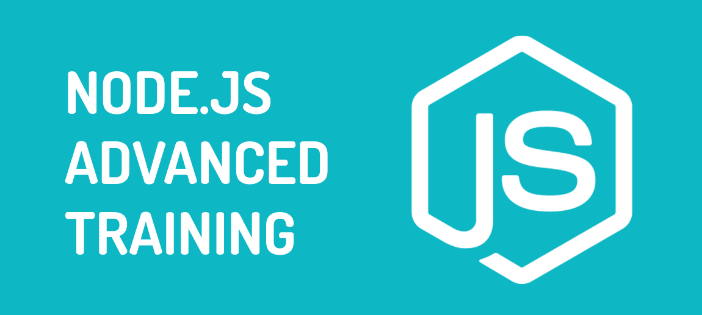

# Node.js Advanced Training 

## Required

 - [JavaScript Base](requirements/javascript-base.md)
 - [JavaScript Advanced](requirements/javascript-advanced.md)
 - [MongoDB Base](requirements/mongodb-base.md)
 - [Redis Base](requirements/redis-base.md)
 - [Linux Base](requirements/linux-base.md)

## Actual for versions:
 - **Node.js 4.2+**
 - **Mongo 3.2+**
 - **Redis 3.0+**

## Program (total: 30h)

### `Training Overview` (15m)

### `JavaScript`

#### [JavaScript Init Check Point](https://docs.google.com/presentation/d/1My6RpHXvAHyc1BCx5bEJhw_FmCyxBKgy5PKhjezjHCQ/edit?usp=sharing) (2h)

 - **Variables**
 - **Conditions**
 - **Loops**
 - **Functions**
 - **Prototypes**
 - **Asynchronous functions**
 - ...

#### [New in ECMAScript 2015 (ES6)](lessons/02-js-ecmascript-2015/materials.md) (2h) [[Homework]](lessons/02-js-ecmascript-2015/homework.md)

 - **Block scoping**
   - let
   - const
 - **Collections**
   - Map
   - WeakMap
   - Set
   - WeakSet
 - **Classes**
 - **Generators**
 - **Promises**
 - **Symbols**
 - **Template strings**
 - **Arrow Functions**
 - ...

#### [JavaScript Style Guides](lessons/03-js-style-guides/materials.md) (15m)

 - **Airbnb Coding Style**
 - **Google JavaScript Style**
 - **JavaScript "Standard" Style**
 - **Crockfords’s Coding Standards**
 - **Node.js Coding Style**
 - **NPM "Funny" Coding Style**
 - **Idiomatic JavaScript Coding Style**

### `Node.js`

#### [Philosophy](lessons/04-nodejs-philosophy/materials.md) (15m)

 - **Small core**
 - **Small modules**
 - **Small surface area**
 - **Simplicity and pragmatism**

#### [Design Fundamentals](lessons/05-nodejs-design-fundamentals/materials.md) (1h)

 - **Conceptions**
   - **Asynchronous**
   - **Event Loop**
   - **IO operations**
   - **Non blocking**

 - **Components**
   - **V8**
   - **libuv**
   - ...

#### [Getting started](lessons/06-nodejs-getting-started/materials.md) (15m)

 - **Versions of Node.js**
 - **Installation Node.js**
 - **CLI commands**
 - **First scripts**

#### [Errors Examples](lessons/07-nodejs-errors-examples/materials.md) (15m)

 - **System errors**
 - **Standard JavaScript errors**
   - **SyntaxError**
   - **ReferenceError**
   - **TypeError**

 - **Assertion Errors**
 - **Custom errors**

#### [Modules and NPM](lessons/08-nodejs-modules-and-npm/materials.md) (1h) [[Homework]](lessons/08-nodejs-modules-and-npm/homework.md)

 - **How it works?**
 - **Supported formats**
 - **Order of load and resolving algorithm**
 - **The module cache**
 - **NPM registry**

#### [Core modules](lessons/09-nodejs-core-modules/materials.md) (2h)

 - **Console**
 - **Process**
 - **Timers**
 - **Errors**
 - **Events**
 - **Stream**
 - **File System**
 - **HTTP**
 - **Crypto**
 - **Child Processes**
 - ...

#### [Useful NPM modules](lessons/10-nodejs-useful-npm-modules/materials.md) (1h)

 - **Lodash**
 - **Async / Neo-async**
 - **WS**
 - **MongoDB**
 - **Redis**
 - **Postgres**
 - ...

#### [Build your own modules](lessons/11-nodejs-create-own-npm-module/materials.md) (1h)

 - **File structure**
 - **Deep with package.json**
 - **Local packages**
 - **Publish to NPM Registry**
 - **Using in application**
 - ...

####  Common Patterns in Node.js (1h)

 - **Callbacks**
 - **Error-first**
 - **Async function in any case**
 - **Recursive async functions**
 - ...

#### [Design Patterns in Node.js](lessons/12-nodejs-design-patterns/materials.md) (4h)

 - **Creational Design Patterns**
   - Singleton
   - Factory
   - Abstract Factory
   - ...

 - **Structural Design Patterns**
   - Adapter
   - Composite
   - Decorator
   - Facade
   - Bridge
   - Proxy
   - ...

 - **Behavioral Design Patterns**
   - Observer
   - ...

#### Asynchronous Control Flow (2h)

 - **The difficulties**
   - The callback hell
   - Specific flows

 - **Flows**
   - Sequential execution
   - Parallel execution
   - Limited parallel execution

 - **Solutions**
   - Pure JS functions
   - Async library
   - Promises
   - Generators

#### [Wiring modules](lessons/13-nodejs-wiring-modules/materials.md) (1h)

 - **Hardcoded dependency**
 - **Dependency injection**
 - **Service locator**
 - **Dependency injection container**

#### Recipes for yours applications (2h)

 - **Run long sync operations**
 - **Run heavy CPU operations**
 - **Connection to MongoDB**
 - **Repository pattern**
 - ...

#### [Testing in Node.js](lessons/15-nodejs-testing/materials.md) (3h)

 - **What we test?**
   - Cases
   - Priority
 - **How to do your testing most effective and fast?**
   - Classes
   - Boundary
   - Test levels
   - Piramida
 - **Approaches**
   - TDD
   - BDD
   - Pairwise
   - Mocks
 - **Tools and libraries**
   - Mocha
   - Should
   - Supertest
   - Sinon
 - **Code Coverage**
 - **Patterns and best practices in testing**
 - **Continuous Integration**
   - Conception
   - Travis CI
 - **Continuous Delivery**
   - Conception

#### [Documentation](lessons/16-nodejs-documentation/materials.md) (1h)

 - **Approaches**
   - README Driven Development
   - Reference documentation
   - Unibutique Language
   - Changelog
   - License

 - **Formats**
   - Markdown
   - RAML

#### The design and architecture of the application (1h)

 - **MVC**
 - **DDD**
 - **SOA**
 - **Micro-services**
 - ...

#### [Projects: Common recommendations](lessons/18-nodejs-services-recommendations/materials.md) (1h)

 - **12 factors app**
 - **Configuration**
 - **Logging**
 - **Monitoring**
 - **Profiling**
 - **Connection to DBs and external services**
 - ...

#### Project 1: Simple web-site

 - **Express**
 - **Serving static content by Node.js**
 - **Using Nginx as reverse proxy and server of static content**

#### Project 2: Service with REST API

 - **Express**
 - **REST API design**
 - **REST API testing**

#### Project 3: Tiny cloud (micro-services)

 - **Micro-services overview**
 - **Communication between services**
 - **HTTP and Message Broker for communication**
 - **Testing of micro-services**

#### Performance and Scaling of application and system (2h)

 - **Scaling**
   - What is scaling?
   - Scaling Law of applications
   - Methods of scaling applications

 - **Performance**
   - What is performance?
   - What should we measure?
   - Tools for performance tests (Yandex.Tank, ab, siege)
   - Analysis of the results
   - Recommendations for scaling

 - **Cache in applications**

#### Profiling and optimizations of application and system (2h)

 - **Top most common mistakes which fail performance**

 - **Profiling**
   - Memory
   - CPU
   - Blocking of EventLoop

 - **Tools**

#### Yours applications in production (1h)

 - **Best practices of logging**
 - **Orchestration (Ansible)**
 - ...

#### Distribution of your application (Docker) (1h)

 - **What is Docker?**
 - **Create Docker image with your application**
 - **Run your applications**
 - **How to run own cloud in 1 click? (Docker Compose)**
 - ...

#### Final Q&A (1h)

# Author

 - [**Andrii Chyzh**](https://github.com/andriichyzh)

# License

This work is licensed under a [Creative Commons Attribution-NonCommercial 4.0 International License](http://creativecommons.org/licenses/by-nc/4.0/legalcode).

