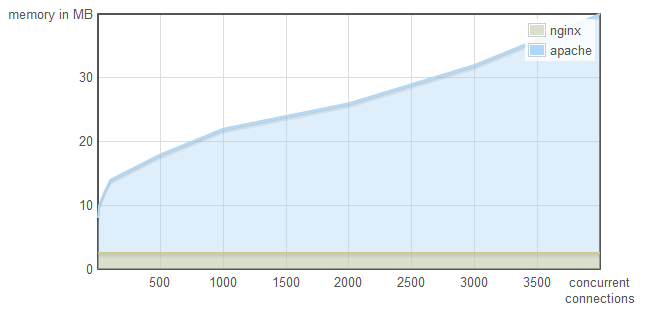
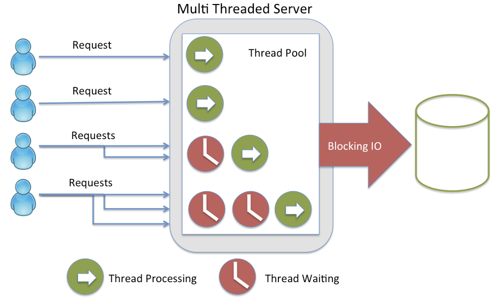
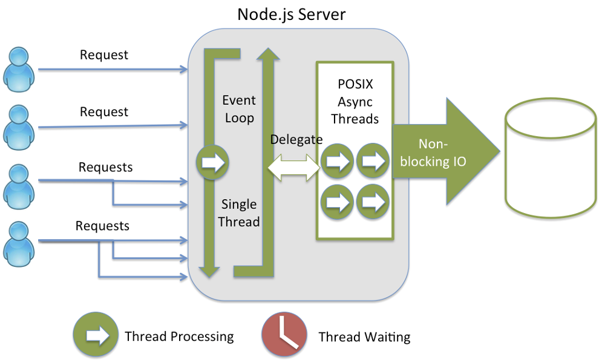
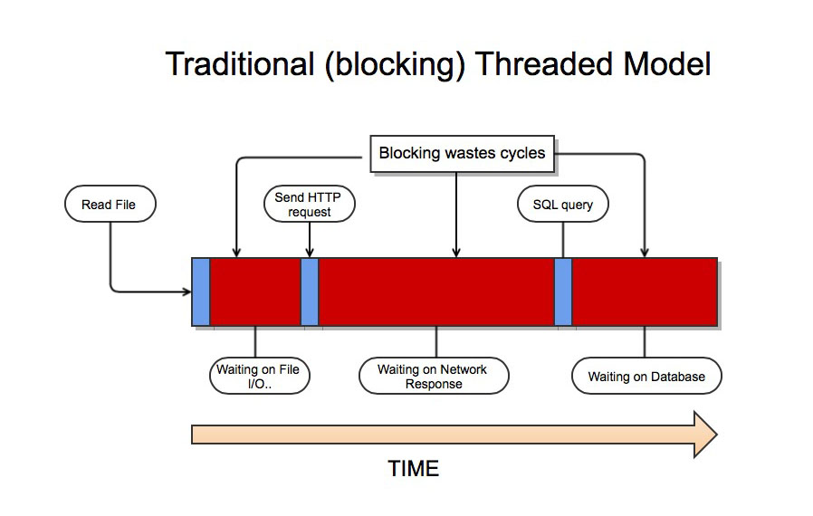
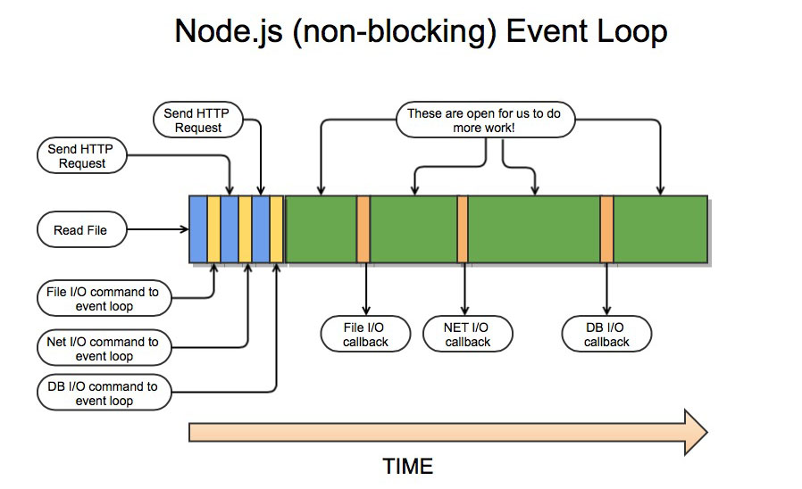
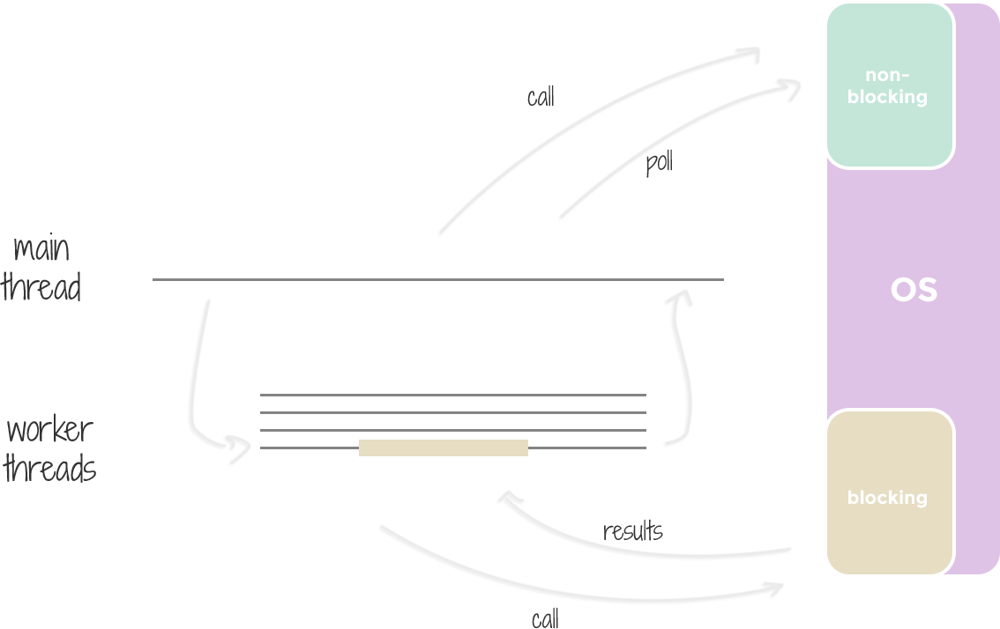
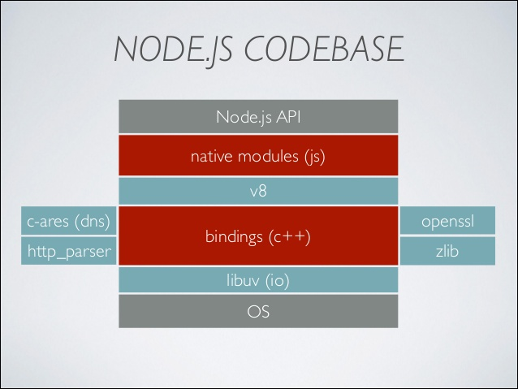

# Node.js Design Fundamentals

 - **Conceptions**
   - **Asynchronous**
   - **Event Loop**
   - **IO operations**
   - **Non blocking**

 - **Components**
   - **V8**
   - **libuv**
   
## Nginx vs Apache

### Capacity

### Memory

## What Makes Node.js Faster Than Java? ([source](https://strongloop.com/strongblog/node-js-is-faster-than-java/))

### Java

### Node.js

## What is the difference between `traditional threaded` model versus Node.js `non-blocking event loop`?

### Java

### Node.js

## Performance Comparisons

 - [Performance Comparison Between Node.js and Java EE](https://dzone.com/articles/performance-comparison-between)
 - [Node.js at PayPal](https://www.paypal-engineering.com/2013/11/22/node-js-at-paypal/)

 
## Operations that are performed in `main thread` using `asynchronous non-blocking` system calls or in `worker threads`. 

### List operations

| Operation   | Main thread   | Worker thread   |
|-------------|:-------------:|:---------------:|
| DNS         |               | X               |
| Filesystem  |               | X               |
| Pipe        | X             |                 |
| TCP         | X             |                 |
| TTY         | X             |                 |
| UDP         | X             |                 |

   

## Components 

**JS + V8 + libuv = Node.js**

### V8

Link: https://developers.google.com/v8/

### Libuv

Link: http://nikhilm.github.io/uvbook/index.html

