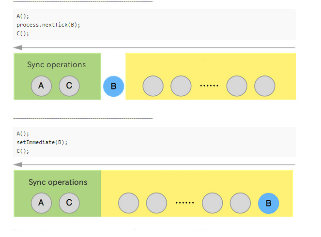
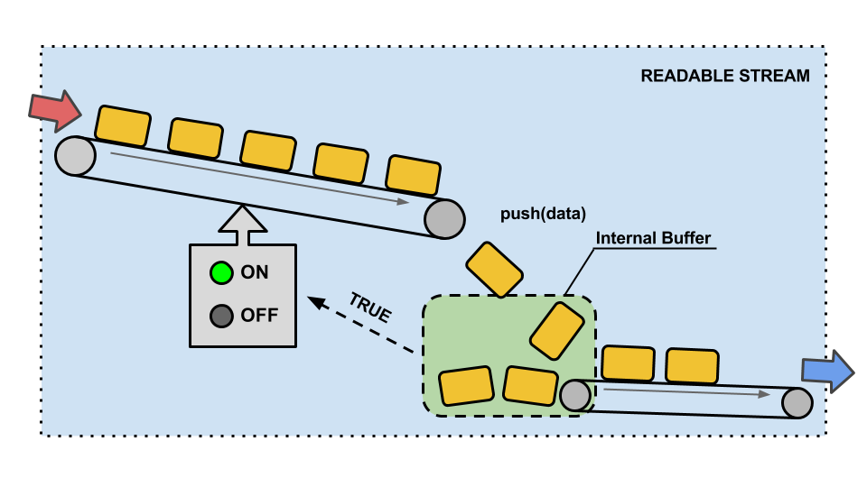
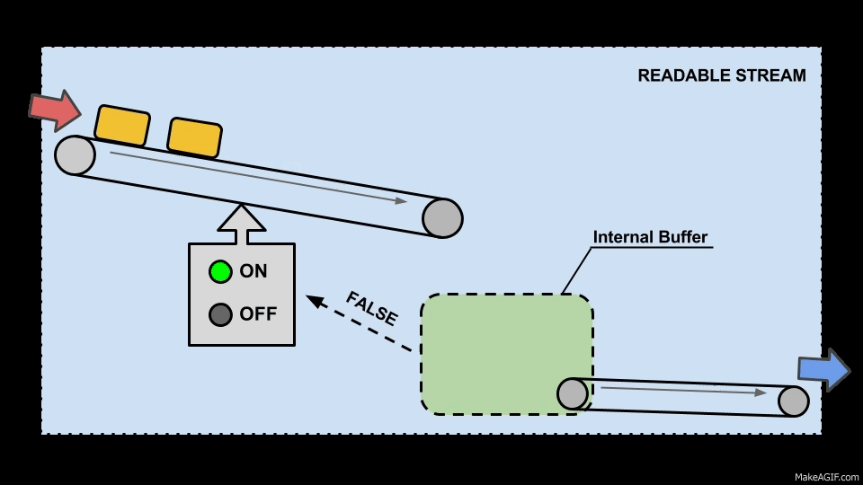
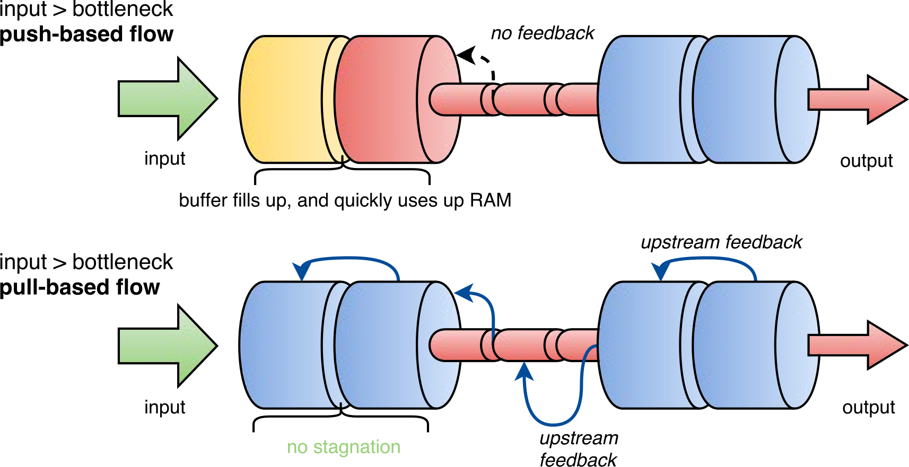

# Core Modules

## [Globals](https://nodejs.org/dist/latest-v4.x/docs/api/globals.html)

### `Class: Buffer`

Used to handle binary data.

### `__dirname`

The name of the directory that the currently executing script resides in. 

### `__filename`

The filename of the code being executed. This is the resolved absolute path of this code file. 

### `console`

Used to print to `stdout` and `stderr`.

### `exports`

A reference to the module.exports that is shorter to type. 

### `global`

The global namespace object.

### `module`

A reference to the current module. In particular module.exports is used for defining what a module exports and makes available through require(). 

### `process`

The process object.

### `require()`

To require modules.

### `setInterval(cb, ms)`

Run callback cb repeatedly every ms milliseconds. 
Note that the actual interval may vary, depending on external factors like OS timer granularity and system load. 
It's never less than ms but it may be longer. 

### `setTimeout(cb, ms)`

Run callback cb after at least ms milliseconds. 
The actual delay depends on external factors like OS timer granularity and system load. 

### `clearInterval(t)`
### `clearTimeout(t)`


## [Assertion Testing](https://nodejs.org/dist/latest-v4.x/docs/api/assert.html)

The `assert` module provides a simple set of assertion tests that can be used to test invariants. 
The module is intended for internal use by Node.js, but can be used in application code via `require('assert')`. 
However, `assert is not a testing framework`, and is `not intended to be used as a general purpose assertion library`. 

## `assert(value[, message]), assert.ok(value[, message])`
## `assert.deepEqual(actual, expected[, message])`
## `assert.deepStrictEqual(actual, expected[, message])`
## `assert.doesNotThrow(block[, error][, message])`
## `assert.equal(actual, expected[, message])`
## `assert.fail(actual, expected, message, operator)`
## `assert.ifError(value)`
## `assert.notDeepEqual(actual, expected[, message])`
## `assert.notDeepStrictEqual(actual, expected[, message])`
## `assert.notEqual(actual, expected[, message])`
## `assert.notStrictEqual(actual, expected[, message])`
## `assert.strictEqual(actual, expected[, message])`
## `assert.throws(block[, error][, message])`


## [Console](https://nodejs.org/dist/latest-v4.x/docs/api/console.html)

The `console` module provides a simple debugging console 

**Exports two specific components:**

 - A `Console` class with methods:
    - `console.log()`
    - `console.info()`
    - `console.error()`
    - `console.warn()`
 - A global `console` instance write to `stdout` and `stderr`. Can be used without calling `require('console')`.

### Global `console`:

```js
console.log('Hello, User A!');
// 'Hello, User A!' (to stdout)

console.info('Connected!', 'I am Robot!');
// 'Connected! I am Robot!' (to stdout)

console.error(new Error('Critical error!'));
// [Error: Critical error!] (to stderr)

console.warn('Validation failed!');
// 'Validation failed!' (to stderr)
```

### Class `Console`

```js
const Console = require('console').Console;
const Console = console.Console;
```

```js
const customConsole = new console.Console(process.stdout, process.stderr);

customConsole.log('Hello, User A!');
// 'Hello, User A!' (to out)

customConsole.info('Hello, User B!');
// 'Hello, User B!' (to out)

customConsole.error(new Error('Critical error!'));
// [Error: Critical error!] (to err)

customConsole.warn('Validation failed!');
// 'Validation failed!' (to err)
```

### `console.error()`

Prints to `stderr` with newline. `Multiple arguments` can be passed, with the first used as the primary message.

Alias: `console.warn()`

```js
console.error([data][, ...])
```


### `console.log()`

Prints to `stdout` with newline. `Multiple arguments` can be passed, with the first used as the primary message.

Alias: `console.info()`

```js
console.log([data][, ...])
```


### `console.assert()`

A simple assertion test that verifies whether value is `truthy`.

```js
console.assert(value[, message][, ...])
```

Example:

```js
console.assert(true, 'Connection failed!');

console.assert(false, 'Parameter `port` is required!');
// AssertionError: Parameter `port` is required!
```


### `console.dir()`

```js
console.dir(obj[, options])
```

Options:

 - `showHidden` - if `true` then the object's non-enumerable and symbol properties will be shown too. Defaults to `false`.
 - `depth` - tells inspect how many times to recurse while formatting the object. This is useful for inspecting large complicated objects. Defaults to `2`. To make it recurse indefinitely, pass null.
 - `colors` - if `true`, then the output will be styled with `ANSI` color codes. Defaults to `false`. 

Example:

```js
console.dir(/node/, { showHidden: true });
```

```bash
{ /node/
  [source]: 'node',
  [global]: false,
  [ignoreCase]: false,
  [multiline]: false,
  [lastIndex]: 0 }
```

### `console.time()` and `console.timeEnd()`

Used to calculate the duration of a specific operation. 

```js
let fib = function fib(n){
    return n < 2 ? n : fib(n - 1) + fib(n - 2);
};

console.time('fib');
fib(30);
console.timeEnd('fib');

// fib: 18ms
```

### `console.trace()`

Prints to `stderr` the formatted message and stack trace to the current position in the code. 

```js
console.trace('Control point');
```

```bash
Trace: Control point
    at Object.<anonymous> (/home/achyzh/Projects/node-js-advanced-training/examples/test.js:3:9)
    at Module._compile (module.js:410:26)
    at Object.Module._extensions..js (module.js:417:10)
    at Module.load (module.js:344:32)
    at Function.Module._load (module.js:301:12)
    at Function.Module.runMain (module.js:442:10)
    at startup (node.js:136:18)
    at node.js:966:3
```

### Examples

#### Logger to files

```js
const Console = require('console').Console;
const fs = require('fs');

const output = fs.createWriteStream('./stdout.log');
const errorOutput = fs.createWriteStream('./stderr.log');

const logger = new Console(output, errorOutput);

logger.info('New request', { params: { id: '12345' } });
```

File `stdout.log`
```bash
New request { params: { id: '12345' } }
```

#### Logger to `stdout` and `stderr` with formatting

```js
const Console = require('console').Console;

const transformer = loggerFormatter(process.stdout);

const logger = new Console(transformer);

logger.info('New request', { params: { id: '12345' } });

// 'New request { params: { id: '12345' } }' (original)
// '2016-02-03T23:27:26.719Z [INFO] New request { "params": { "id": "12345" } }' (formatted)
```

***


## [Process](https://nodejs.org/dist/latest-v4.x/docs/api/process.html)

### `process.cwd()`
   
Returns the current working directory of the process.

```js
console.log('Current directory:', process.cwd()); // Current directory: /home/achyzh/Projects/node-js-advanced-training
```

### `process.chdir(directory)`

```js
console.log('Current directory:', process.cwd()); // Current directory: /home/achyzh/Projects/node-js-advanced-training

process.chdir('/tmp');

console.log('Current directory:', process.cwd()); // Current directory: /tmp
```

### `process.env`

An object containing the user environment

#### Get

```js
console.log(process.env);
```

```js
{ 
  TERM: 'xterm-256color',
  PAPERSIZE: 'letter',
  XDG_SESSION_PATH: '/org/freedesktop/DisplayManager/Session0',
  UPSTART_SESSION: 'unix:abstract=/com/ubuntu/upstart-session/1000/2919',
  ...
  DESKTOP_SESSION: 'ubuntu',
  DISPLAY: ':0',
  LC_MONETARY: 'en_US.UTF-8',
  USER: 'achyzh',
  HOME: '/home/achyzh',
}
```

#### Set

```js
process.env.NODE_ENV = 'test';
console.log(process.env.NODE_ENV); // 'test'
```

### process.pid

The `PID` of the process.

```js
console.log(process.pid); // 2891
```

### `process.argv`

An array containing the command line arguments. 
The first element will be 'node', the second element will be the name of the JavaScript file. 
The next elements will be any additional command line arguments.
 
Create file `test.js`:

```js
console.log(process.argv);
```

Run:

```bash
node examples/test.js --test
```

Output:

```js
[ '/home/achyzh/.nvm/versions/node/v4.2.6/bin/node', 
  '/home/achyzh/Projects/node-js-advanced-training/examples/test.js', 
  '--test' ]
```

### `process.execArgv`

This is the set of Node.js-specific command line options from the executable that started the process. These options are useful in order to spawn child processes with the same execution environment as the parent.

```bash
$ node --expose-gc script.js --version
```

```js
console.log(process.execArgv); // ['--expose-gc']
console.log(process.argv); // ['/usr/local/bin/node', 'script.js', '--version']
```

### `process.exit([code])`

Ends the process with the specified code. If omitted, exit uses the 'success' code 0.

```js
process.exit(); // success

process.exit(1); // failure
```

### `process.hrtime()`

Returns the current high-resolution real time in a [seconds, nanoseconds] tuple Array. The primary use is for measuring performance between intervals.

You may pass in the result of a previous call to `process.hrtime()` to get a diff reading, useful for benchmarks and measuring intervals:

```js
var time = process.hrtime();
// [ 1800216, 25 ]

setTimeout(() => {
  var diff = process.hrtime(time);
  // [ 1, 552 ]

  console.log('benchmark took %d nanoseconds', diff[0] * 1e9 + diff[1]);
  // benchmark took 1000000527 nanoseconds
}, 1000);
```

### `process.memoryUsage()`

Returns an object describing the `memory usage` of the Node.js process measured in bytes.

```js
console.log(process.memoryUsage());
```

Output:

```js
{ rss: 4935680,
  heapTotal: 1826816,
  heapUsed: 650472 }
```

Note: `heapTotal` and `heapUsed` refer to `V8`'s memory usage. 


### `process.nextTick(callback[, arg][, ...])`
    
Once the current event loop turn runs to completion, call the callback function.
    
This is not a simple alias to `setTimeout(fn, 0)`, it's much more efficient. 
**It runs `before any additional I/O events` (including timers) fire in subsequent ticks of the event loop.**
    
```js
console.log('start');
process.nextTick(() => {
  console.log('nextTick callback');
});
console.log('scheduled');
```

Output:

```
// start
// scheduled
// nextTick callback
```
      
This is important in developing APIs where you want to give the user the chance to assign event handlers after an object has been constructed, but before any I/O has occurred.
   
```js
function MyThing(options) {
  this.setupOptions(options);

  process.nextTick(() => {
    this.startDoingStuff();
  }.bind(this));
}

var thing = new MyThing();
thing.getReadyForStuff();

// thing.startDoingStuff() gets called now, not before.
```

It is very important for APIs to be either `100% synchronous` or `100% asynchronous`. 

Consider this example:

```js
// WARNING! DO NOT USE! BAD UNSAFE HAZARD!
function maybeSync(arg, cb) {
    if (arg) {
        return cb();
    }

    fs.stat('file', cb);
}
```    

This API is hazardous. If you do this:

```js
maybeSync(true, function() {
    foo();
});

bar();
```

then it's not clear whether `foo()` or `bar()` will be called first.
    
This approach is much better:
   
```js
function definitelyAsync(arg, cb) {
    if (arg) {
        return process.nextTick(cb);
    }

    fs.stat('file', cb);
}
```
 
Note: The `nextTick` queue is completely drained on each pass of the event loop `before additional I/O is processed`. 
**As a result, `recursively setting nextTick callbacks will block any I/O from happening`, just like a while(true); loop.**


### `process.stdin`

A `Readable Stream` for `stdin` (on fd 0).

### `process.stdout`

A `Writable Stream` to `stdout` (on fd 1). 

### `process.stderr`

A `Writable Stream` to `stderr` (on fd 2).

Notes: `process.stderr` and `process.stdout` are unlike other streams in Node.js in that they `cannot be closed` (end() will throw).
They `never emit the finish event` and that writes `can block when output is redirected to a file` (although disks are fast and operating systems normally employ write-back caching so it should be a very rare occurrence indeed.)


### `Event: 'uncaughtException'`

Emitted when an exception bubbles all the way back to the event loop. 
If a listener is added for this exception, the default action (which is to print a stack trace and exit) will not occur. 

```js
process.on('uncaughtException', (err) => {
  console.log(`Caught exception: ${err}`);
});

setTimeout(() => {
  console.log('This will still run.');
}, 500);

// Intentionally cause an exception, but don't catch it.
nonexistentFunc();
console.log('This will not run.');
```

```bash
// Caught exception: ReferenceError: nonexistentFunc is not defined
// This will still run.
```

Note that `uncaughtException` is a very crude mechanism for exception handling. 

`uncaughtException` should be used to perform synchronous cleanup before shutting down the process. 
It is not safe to resume normal operation after 'uncaughtException'. 
If you do use it, restart your application after every unhandled exception! 

#### Exit Codes

Node.js will normally exit with a 0 status code when no more async operations are pending. The following status codes are used in other cases:

 - `1 Uncaught Fatal Exception` - There was an uncaught exception, and it was not handled by a domain or an 'uncaughtException' event handler.
 - `2` - Unused (reserved by Bash for builtin misuse)
 - `3 Internal JavaScript Parse Error` - The JavaScript source code internal in Node.js's bootstrapping process caused a parse error. This is extremely rare, and generally can only happen during development of Node.js itself.
 - `4 Internal JavaScript Evaluation Failure` - The JavaScript source code internal in Node.js's bootstrapping process failed to return a function value when evaluated. This is extremely rare, and generally can only happen during development of Node.js itself.
 - `5 Fatal Error` - There was a fatal unrecoverable error in V8. Typically a message will be printed to stderr with the prefix FATAL ERROR.
 - `6 Non-function Internal Exception Handler` - There was an uncaught exception, but the internal fatal exception handler function was somehow set to a non-function, and could not be called.
 - `7 Internal Exception Handler Run-Time Failure` - There was an uncaught exception, and the internal fatal exception handler function itself threw an error while attempting to handle it. This can happen, for example, if a process.on('uncaughtException') or domain.on('error') handler throws an error.
 - `8` - Unused. In previous versions of Node.js, exit code 8 sometimes indicated an uncaught exception.
 - `9 - Invalid Argument` - Either an unknown option was specified, or an option requiring a value was provided without a value.
 - `10 Internal JavaScript Run-Time Failure` - The JavaScript source code internal in Node.js's bootstrapping process threw an error when the bootstrapping function was called. This is extremely rare, and generally can only happen during development of Node.js itself.
 - `12 Invalid Debug Argument` - The --debug and/or --debug-brk options were set, but an invalid port number was chosen.
 - `>128 Signal Exits` - If Node.js receives a fatal signal such as SIGKILL or SIGHUP, then its exit code will be 128 plus the value of the signal code. This is a standard Unix practice, since exit codes are defined to be 7-bit integers, and signal exits set the high-order bit, and then contain the value of the signal code.
    

## [Timers](https://nodejs.org/dist/latest-v4.x/docs/api/timers.html)

All of the timer functions are `globals`. You do not need to `require()` this module in order to use them. 

### `setTimeout(callback, delay[, arg][, ...])`

To schedule execution of a `one-time callback after delay milliseconds`. 

Returns a `timeoutObject` for possible use with `clearTimeout()`. Optionally you can also pass arguments to the callback.

It is important to `note that your callback will probably not be called in exactly delay milliseconds`.
`Node.js makes no guarantees about the exact timing of when the callback will fire`, nor of the ordering things will fire in. 
`The callback will be called as close as possible to the time specified.`

To follow browser behavior, when using delays larger than `2147483647` milliseconds (approximately 25 days) or less than `1`, the timeout is executed immediately, as if the delay was set to `1`.


### `setInterval(callback, delay[, arg][, ...])`

To schedule the `repeated execution of callback every delay milliseconds`. 

Returns a `intervalObject` for possible use with `clearInterval()`. Optionally you can also pass arguments to the callback.

To follow browser behavior, when using delays larger than `2147483647` milliseconds (approximately 25 days) or less than `1`, Node.js will use `1` as the delay.


### `setImmediate(callback[, arg][, ...])`

To schedule the `"immediate" execution of callback after I/O events callbacks` and `before setTimeout() and setInterval()`. 

Returns an `immediateObject` for possible use with `clearImmediate()`. Optionally you can also pass arguments to the callback.

`Callbacks for immediates are queued in the order in which they were created.` 

The entire callback queue is processed every event loop iteration. 
If you queue an immediate from inside an executing callback, that immediate won't fire until the next event loop iteration.


### `unref()`

The opaque value returned by `setTimeout` and `setInterval` also has the method `timer.unref()` which will allow you to create a timer that is active but if it is the only item left in the event loop, it won't keep the program running. 
If the timer is already `unrefd` calling `unref` again will have no effect.

In the case of `setTimeout` when you `unref` you create a separate timer that will `wakeup the event loop`, creating too many of these may adversely effect event loop performance -- use wisely.

Returns the `timer`. 


### `ref()`

If you had previously `unref()` a timer you can call `ref()` to explicitly request the timer hold the program open. 
If the timer is already `refd` calling `ref` again will have no effect.

Returns the `timer`. 


### `clearImmediate(immediateObject)`

Stops an immediate from triggering.


### `clearInterval(intervalObject)`

Stops an interval from triggering.


### `clearTimeout(timeoutObject)`

Prevents a timeout from triggering.


## `Important!` Difference `setImmediate()` vs `process.nextTick()`




**References:**

 - [Tracking Down Performance Bottlenecks in Node.js with Meteor & StrongLoop](https://strongloop.com/strongblog/node-js-performance-meteor/)

### Execution order

```js
const fs = require('fs');

// I/O operation
fs.stat(__filename, function() {
    console.log('[1] I/O operation');
});

// setTimeout 0
setTimeout(function() {
    console.log('[2] setTimeout 0');
}, 0);

// setTimeout 25
setTimeout(function() {
    console.log('[3] setTimeout 25');
}, 25);

// setImmediate
setImmediate(function() {
    console.log('[4] setImmediate');
});

// process.nextTick
process.nextTick(function() {
    console.log('[5] process.nextTick');
});

console.log('[6] sync operation');
```

Output:

```bash
[6] sync operation
[5] process.nextTick
[2] setTimeout 0
[1] I/O operation
[4] setImmediate
[3] setTimeout 25
```

### Blocking of event loop

```js
var mode = process.argv[2];

var steps = 0;

console.time('Total time');

function run() {
    steps++;

    for (var i = 0, max = 1e7; i < max; i++) {
        Math.pow(Math.random(), Math.random());
    }

    if (steps === 10) {
        console.timeEnd('Total time');
        return;
    }

    switch(mode) {
        case 'blocked':
            run();
            break;

        case 'nexttick':
            process.nextTick(run);
            break;

        case 'setimmediate':
            setImmediate(run);
            break;

        case 'settimeout':
            setTimeout(run, 10);
            break;
    }
}

function checkIsBlocked() {
    var delay = 10;
    var start = process.hrtime();

    setTimeout(function() {
        var elapsed = process.hrtime(start);
        var time = (elapsed[0] * 1000) + (elapsed[1] / 1e6);

        console.log("I took %s ms! Expected to take %s ms!", time.toFixed(2), delay);
    }, delay);
}


checkIsBlocked();
run();
```

Run:

```bash
node lessons/09-nodejs-core-modules/examples/event-loop/blocks.js

// I took 132.87 ms! Expected to take 10 ms!
```

```bash
node lessons/09-nodejs-core-modules/examples/event-loop/blocks.js nexttick

// Total time: 1263ms
// I took 1263.86 ms! Expected to take 10 ms!
```

```bash
node lessons/09-nodejs-core-modules/examples/event-loop/blocks.js setimmediate                                               

// I took 153.51 ms! Expected to take 10 ms!
// Total time: 1266ms
```

```bash
node lessons/09-nodejs-core-modules/examples/event-loop/blocks.js settimeout  

// I took 132.59 ms! Expected to take 10 ms!
// Total time: 2855ms                                   
```


## [V8](https://nodejs.org/dist/latest-v4.x/docs/api/v8.html)

This module exposes events and interfaces specific to the version of V8 built with Node.js. 
These interfaces are subject to change by upstream and are therefore not covered under the stability index. 

### `getHeapStatistics()`

Returns an object with the following properties
 
```js
{
  total_heap_size: 7326976,
  total_heap_size_executable: 4194304,
  total_physical_size: 7326976,
  total_available_size: 1152656,
  used_heap_size: 3476208,
  heap_size_limit: 1535115264
}
```


## [OS](https://nodejs.org/dist/latest-v4.x/docs/api/os.html)

### `EOL`

A constant defining the appropriate `End-of-line` marker for the operating system. 

```bash
'\n'
```  

### `arch()`

Returns the operating system CPU architecture. 
Possible values are 'x64', 'arm' and 'ia32'. 
Returns the value of process.arch.

### `platform()`

Returns the operating system platform. 
Possible values are 'darwin', 'freebsd', 'linux', 'sunos' or 'win32'. 
Returns the value of process.platform. 
        
### `cpus()`

Returns an array of objects containing information about each CPU/core installed: model, speed (in MHz), and times (an object containing the number of milliseconds the CPU/core spent in: user, nice, sys, idle, and irq). 

```js
[ { model: 'Intel(R) Core(TM)2 Duo CPU  P8800  @ 2.66GHz',
    speed: 2660,
    times: { user: 2678470, nice: 0, sys: 1034200, idle: 6800870, irq: 0 } },
  { model: 'Intel(R) Core(TM)2 Duo CPU  P8800  @ 2.66GHz',
    speed: 2660,
    times: { user: 2851230, nice: 0, sys: 839510, idle: 6821950, irq: 0 } } ]
```

### `loadavg()`

Returns an array containing the 1, 5, and 15 minute load averages.

The load average is a measure of system activity, calculated by the operating system and expressed as a fractional number. 
As a rule of thumb, the load average should ideally be less than the number of logical CPUs in the system. 

```js
[ 3.68115234375, 4.0693359375, 4.09619140625 ]
```

### `freemem()`

Returns the amount of free system memory in bytes. 

```js
2026799104
```

### `totalmem()`
        
Returns the total amount of system memory in bytes. 

```js
8589934592
```

### `hostname()`

Returns the hostname of the operating system. 

```js
'andriis-mbp.sync.com'
```   

### `networkInterfaces()`

Get a list of network interfaces: 

```js
{ lo0: 
   [ { address: '::1',
       netmask: 'ffff:ffff:ffff:ffff:ffff:ffff:ffff:ffff',
       family: 'IPv6',
       mac: '00:00:00:00:00:00',
       scopeid: 0,
       internal: true },
     { address: '127.0.0.1',
       netmask: '255.0.0.0',
       family: 'IPv4',
       mac: '00:00:00:00:00:00',
       internal: true },
     { address: 'fe80::1',
       netmask: 'ffff:ffff:ffff:ffff::',
       family: 'IPv6',
       mac: '00:00:00:00:00:00',
       scopeid: 1,
       internal: true } ],
  en1: 
   [ { address: 'fe80::fa1e:dfff:fedb:6531',
       netmask: 'ffff:ffff:ffff:ffff::',
       family: 'IPv6',
       mac: 'f8:1e:df:db:65:31',
       scopeid: 5,
       internal: false },
     { address: '172.22.199.109',
       netmask: '255.255.255.0',
       family: 'IPv4',
       mac: 'f8:1e:df:db:65:31',
       internal: false } ] }
```

### `uptime()`  
      
Returns the system uptime in seconds. 
        
```js        
11789        
```
        
### `homedir()`

Returns the home directory of the current user. 

```js
'/Users/achyzh'
```

### `tmpdir()`

Returns the operating system's default directory for temporary files. 

```js
'/var/folders/lp/ggx7v95530l3bzr9zbmbtlgm0000gn/T'
```


## [Utils](https://nodejs.org/dist/latest-v4.x/docs/api/util.html)

These functions are in the module 'util'. Use `require('util')` to access them. 

### util.inherits(constructor, superConstructor)

`Inherit the prototype methods from one constructor into another.` The prototype of constructor will be set to a new object created from superConstructor.

Example:

```js
const util = require('util');
const EventEmitter = require('events');

function MyStream() {
    EventEmitter.call(this);
}

util.inherits(MyStream, EventEmitter);

MyStream.prototype.write = function(data) {
    this.emit('data', data);
}


var stream = new MyStream();

console.log(stream instanceof EventEmitter); // true

stream.on('data', (data) => {
    console.log(`Received data: "${data}"`);
});

stream.write('It works!'); // Received data: "It works!"
```

### util.format(format[, ...])
   
Returns a formatted string using the first argument as a printf-like format.
    
The first argument is a string that contains zero or more placeholders. Each placeholder is replaced with the converted value from its corresponding argument. Supported placeholders are:

 - `%s` - String.
 - `%d` - Number (both integer and float).
 - `%j` - JSON. Replaced with the string '[Circular]' if the argument contains circular references.
 - `%%` - single percent sign ('%'). This does not consume an argument.

If the placeholder `does not have a corresponding argument`, `the placeholder is not replaced`.

```js
util.format('%s:%s', 'foo'); // 'foo:%s'
```
    
If there are more arguments than placeholders, the extra arguments are coerced to strings (for objects and symbols, util.inspect() is used) and then concatenated, delimited by a space.

```js    
util.format('%s:%s', 'foo', 'bar', 'baz'); // 'foo:bar baz'
```
   
If the first argument is not a format string then util.format() returns a string that is the `concatenation of all its arguments separated by spaces`. Each argument is converted to a string with util.inspect().

```js   
util.format(1, 2, 3); // '1 2 3'
```


## [Errors](https://nodejs.org/dist/latest-v4.x/docs/api/errors.html)

### Error Propagation and Interception

#### `Synchronous`

```js
// Throws with a ReferenceError because z is undefined
try {
  const m = 1;
  const n = m + z;
} catch (err) {
  // Handle the error here.
}
```

#### `Asynchronous`

 - Most asynchronous methods that accept a `callback function will accept an Error object passed as the first argument to that function`. 
 If that first argument is `not null` and is `an instance of Error`, then an error occurred that should be handled.

```js
const fs = require('fs');

fs.readFile('a file that does not exist', (err, data) => {
    if (err) {
        console.error('There was an error reading the file!', err);
        return;
    }
    // Otherwise handle the data
});
```

Most asynchronous methods exposed by the Node.js core API follow an idiomatic pattern referred to as a "Node.js style callback". 
With this pattern, a callback function is passed to the method as an argument. 
When the operation either completes or an error is raised, the callback function is called with the Error object (if any) passed as the first argument. 
If no error was raised, the first argument will be passed as null.

```js
const fs = require('fs');

function nodeStyleCallback(err, data) {
    if (err) {
        console.error('There was an error', err);
        return;
    }
    console.log(data);
}

fs.readFile('/some/file/that/does-not-exist', nodeStyleCallback);
fs.readFile('/some/file/that/does-exist', nodeStyleCallback)
```

The JavaScript `try / catch` mechanism `cannot be used to intercept errors generated by asynchronous APIs`. 
A common mistake for beginners is to try to use throw inside a Node.js style callback: 

```js
// THIS WILL NOT WORK:
const fs = require('fs');

try {
    fs.readFile('/some/file/that/does-not-exist', (err, data) => {
        // mistaken assumption: throwing here...
        if (err) {
            throw err;
        }
    });
} catch(err) {
    // This will not catch the throw!
    console.log(err);
}
```

 - When an asynchronous method is called on an object that is an `EventEmitter`, errors can be routed to that object's 'error' event.
 
```js
const net = require('net');
const connection = net.connect('localhost');

// Adding an 'error' event handler to a stream:
connection.on('error', (err) => {
    // If the connection is reset by the server, or if it can't
    // connect at all, or on any sort of error encountered by
    // the connection, the error will be sent here.
    console.error(err);
});

connection.pipe(process.stdout);
```

For all `EventEmitter` objects, if an 'error' event handler is not provided, the error will be thrown, causing the Node.js process to report an unhandled exception and crash unless either: The domain module is used appropriately or a handler has been registered for the process.on('uncaughtException') event.

```js
const EventEmitter = require('events');
const ee = new EventEmitter();

setImmediate(() => {
    // This will crash the process because no 'error' event
    // handler has been added.
    ee.emit('error', new Error('This will crash'));
});
```

**Errors generated in this way cannot be intercepted using try / catch as they are thrown after the calling code has already exited.**

### `Class: Error`

A generic JavaScript Error object that does not denote any specific circumstance of why the error occurred. 
Error objects capture a "stack trace" detailing the point in the code at which the Error was instantiated, and may provide a text description of the error.

All errors generated by Node.js, including all System and JavaScript errors, will either be instances of, or inherit from, the Error class. 

### `new Error(message)`

Creates a `new Error` object and sets the `error.message` property to the provided text message. 
If an object is passed as message, the text message is generated by calling `message.toString()`. 
The `error.stack` property will represent the point in the code at which `new Error()` was called. 

### `Error.captureStackTrace(targetObject[, constructorOpt])`

Creates a `.stack` property on `targetObject`, which when accessed returns a string representing the location in the code at which `Error.captureStackTrace()` was called. 

The optional `constructorOpt` argument accepts a function. 
If given, all frames above `constructorOpt`, including `constructorOpt`, will be `omitted from the generated stack trace`. 

The `constructorOpt` argument is useful for `hiding implementation details of error generation from an end user`.

```js
function MyError() {
    Error.captureStackTrace(this, MyError);
}
```

### `Error.stackTraceLimit`

The `Error.stackTraceLimit` property specifies the `number of stack frames collected by a stack trace`.

The default value is `10` but may be set to any valid JavaScript number. 
Changes will affect any stack trace captured `after` the value has been changed. 

### `error.message`

Returns the `string description of error` as set by calling `new Error(message)`.
The `message` passed to the constructor will also appear `in the first line of the stack trace of the Error`.

```js
const err = new Error('The error');

console.log(err.message); // 'The error'
```

### `error.stack`

Returns a `string describing the point in the code` at which the `Error` was instantiated.

```bash
Error: Things keep happening!
   at /home/gbusey/file.js:525:2
   at Frobnicator.refrobulate (/home/gbusey/business-logic.js:424:21)
   at Actor.<anonymous> (/home/gbusey/actors.js:400:8)
   at increaseSynergy (/home/gbusey/actors.js:701:6)
```

### `Exceptions vs. Errors`
    
A JavaScript exception is a value that is thrown as a `result of an invalid operation or as the target of a throw statement`. 
While it is not required that these values are instances of Error or classes which inherit from Error, all exceptions thrown by Node.js or the JavaScript runtime will be instances of Error. 


## [Events](https://nodejs.org/dist/latest-v4.x/docs/api/events.html)

Much of the Node.js core API is built around an idiomatic asynchronous event-driven architecture in which certain kinds of objects (called "emitters") periodically emit named events that cause Function objects ("listeners") to be called. 


All objects that emit events are instances of the `EventEmitter` class. 
These objects expose an `eventEmitter.on()` function that allows one or more Functions to be attached to named events emitted by the object. 
Typically, event names are camel-cased strings but any valid JavaScript property key can be used.


When the `EventEmitter` object emits an event, `all of the Functions attached to that specific event are called synchronously`. 
Any values returned by the called listeners are ignored and will be discarded.

The following example shows a simple `EventEmitter` instance with a single listener. 
The `eventEmitter.on()` method is used to `register listeners`, while the `eventEmitter.emit()` method is used to `trigger` the event. 

#### `Traditional Node.js style prototypical inheritance`

```js
const EventEmitter = require('events');
const util = require('util');


function MyEmitter() {
    EventEmitter.call(this);
}

util.inherits(MyEmitter, EventEmitter);


const myEmitter = new MyEmitter();

myEmitter.on('event', function() {
    console.log('an event occurred!');
});

myEmitter.emit('event');
```

#### `ES6`

```js
const EventEmitter = require('events');


class MyEmitter extends EventEmitter {}


const myEmitter = new MyEmitter();

myEmitter.on('event', function() {
    console.log('an event occurred!');
});

myEmitter.emit('event');
```

### `Passing arguments and this to listeners`

The `eventEmitter.emit()` method allows an `arbitrary set of arguments` to be passed to the listener functions. 
It is important to keep in mind that when an ordinary listener function is called by the `EventEmitter`, the standard this keyword is intentionally set to reference the `EventEmitter` to which the listener is attached. 

```js
const EventEmitter = require('events');
const util = require('util');


function MyEmitter() {
    EventEmitter.call(this);
}

util.inherits(MyEmitter, EventEmitter);


const myEmitter = new MyEmitter();

myEmitter.on('event', function(a, b) {
    console.log(a, b, this instanceof MyEmitter); // a b true
});

myEmitter.emit('event', 'a', 'b');
```

It is possible to use `ES6 Arrow Functions` as listeners, however, when doing so, the this keyword will no longer reference the `EventEmitter` instance:

```js
const myEmitter = new MyEmitter();

myEmitter.on('event', (a, b) => {
    console.log(a, b, this);  // a b {}
});

myEmitter.emit('event', 'a', 'b');
```

### `Asynchronous vs. Synchronous`

The `EventListener` calls all listeners `synchronously in the order in which they were registered`. 
This is important to ensure the proper sequencing of events and to avoid race conditions or logic errors. 
When appropriate, listener functions can switch to an asynchronous mode of operation using the `setImmediate()` or `process.nextTick()` methods: 

```js
const myEmitter = new MyEmitter();

myEmitter.on('event', (a, b) => {
    setImmediate(() => {
        console.log('this happens asynchronously');
    });
});

myEmitter.emit('event', 'a', 'b');
```

### `Handling events only once`

When a listener is registered using the `eventEmitter.on()` method, that listener will be `invoked every time the named event is emitted`.

```js
const myEmitter = new MyEmitter();

var count = 0;

myEmitter.on('event', () => {
    console.log(++count);
});

myEmitter.emit('event');
// Prints: 1
  
myEmitter.emit('event');
// Prints: 2
```

Using the `eventEmitter.once()` method, it is possible to register a listener that is `immediately unregistered after it is called`.

```js
const myEmitter = new MyEmitter();

var count = 0;

myEmitter.once('event', () => {
    console.log(++count);
});

myEmitter.emit('event');
// Prints: 1
  
myEmitter.emit('event');
// Ignored
```

### `Error events`

When an error occurs within an `EventEmitter` instance, the typical action is for an `'error'` event to be emitted. 
These are treated as a special case within Node.js.

**If an `EventEmitter` does not have at least one listener registered for the `'error'` event, and an `'error'` event is emitted, the error is thrown, a stack trace is printed, and the Node.js process exits.**

```js
const myEmitter = new MyEmitter();

myEmitter.emit('error', new Error('whoops!'));
// Throws and crashes Node.js
```

To guard against crashing the Node.js process, developers can either register a listener for the `process.on('uncaughtException')` event.

```js
const myEmitter = new MyEmitter();

process.on('uncaughtException', (err) => {
    console.log('whoops! there was an error');
});

myEmitter.emit('error', new Error('whoops!'));
// Prints: whoops! there was an error
```

`Best practice`: `Developers should always register listeners for the 'error' event!`

```js
const myEmitter = new MyEmitter();

myEmitter.on('error', (err) => {
    console.log('whoops! there was an error');
});

myEmitter.emit('error', new Error('whoops!'));
// Prints: whoops! there was an error
```

### `Class: EventEmitter`

The `EventEmitter` class is defined and exposed by the events module:

```js
const EventEmitter = require('events');
```

All `EventEmitters` emit the event `'newListener'` when new listeners are added and `'removeListener'` when a listener is removed.

#### `Event: 'newListener'`

 - `event` String|Symbol The event name
 - `listener` Function The event handler function

The `EventEmitter` instance will emit it's own `'newListener'` event `before` a listener is added to it's internal array of listeners.

Listeners registered for the `'newListener'` event will be passed the `event name` and a `reference to the listener being added`.

The fact that the event is triggered before adding the listener has a subtle but important side effect: any additional listeners registered to the same name within the 'newListener' callback will be inserted before the listener that is in the process of being added.

```js
const myEmitter = new MyEmitter();

// Only do this once so we don't loop forever
myEmitter.once('newListener', (event, listener) => {
    if (event === 'event') {
        // Insert a new listener in front
        myEmitter.on('event', () => {
            console.log('B');
        });
    }
});

myEmitter.on('event', () => {
    console.log('A');
});

myEmitter.emit('event');
  // Prints:
  //   B
  //   A

#### `Event: 'removeListener'`

 - `event` String|Symbol The event name
 - `listener` Function The event handler function

The `'removeListener'` event is emitted after a listener is removed.


### `EventEmitter.defaultMaxListeners`

By default, a `maximum of 10 listeners can be registered for any single event`. 
This limit can be changed for individual `EventEmitter` instances using the `emitter.setMaxListeners(n)` method. 
To change the default for all `EventEmitter` instances, the `EventEmitter.defaultMaxListeners` property can be used.

Take caution when setting the `EventEmitter.defaultMaxListeners` because the `change effects all EventEmitter instances`, including those created before the change is made. 
However, calling `emitter.setMaxListeners(n)` still has precedence over `EventEmitter.defaultMaxListeners`.

Note that this is not a hard limit. 
The EventEmitter instance will allow more listeners to be added but will output a trace warning to stderr indicating that a possible EventEmitter memory leak has been detected. 

For any single `EventEmitter`, the `emitter.getMaxListeners()` and `emitter.setMaxListeners()` methods can be used to temporarily avoid this warning:

```js
emitter.setMaxListeners(emitter.getMaxListeners() + 1);

emitter.once('event', () => {
  // do stuff
  emitter.setMaxListeners(Math.max(emitter.getMaxListeners() - 1, 0));
});
```

### `emitter.addListener(event, listener)`

Alias for `emitter.on(event, listener)`.

### `emitter.emit(event[, arg1][, arg2][, ...])`

`Synchronously` calls each of the listeners registered for event, in the order they were registered, passing the supplied arguments to each.

`Returns true if event had listeners, false otherwise.`

### `emitter.getMaxListeners()`

Returns the current max listener value for the `EventEmitter` which is either set by `emitter.setMaxListeners(n)` or defaults to `EventEmitter.defaultMaxListeners`.

### `emitter.listenerCount(event)`

 - `event` Value The type of event

`Returns the number of listeners listening to the event type.`


### `emitter.listeners(event)`

Returns a `copy of the array of listeners` for the specified event.

```js
server.on('connection', (stream) => {
    console.log('someone connected!');
});

console.log(util.inspect(server.listeners('connection')));
// Prints: [ [Function] ]
```


### `emitter.on(event, listener)`

`Adds the listener function to the end of the listeners array for the specified event`. 
No checks are made to see if the listener has already been added. 
Multiple calls passing the same combination of event and listener will result in the listener being added, and called, multiple times.

```js
server.on('connection', (stream) => {
    console.log('someone connected!');
});
```

Returns a `reference to the EventEmitter` so calls `can be chained`.


### `emitter.once(event, listener)`

Adds a `one time listener function for the event`. 
This listener is invoked only the next time event is triggered, `after which it is removed`.

```js
server.once('connection', (stream) => {
    console.log('Ah, we have our first user!');
});
```

Returns a `reference to the EventEmitter` so calls `can be chained`.


### `emitter.removeAllListeners([event])`

`Removes all listeners`, or those of the specified event.

Note that it is bad practice to remove listeners added elsewhere in the code, particularly when the EventEmitter instance was created by some other component or module (e.g. sockets or file streams).

Returns a `reference to the EventEmitter` so calls `can be chained`.


### `emitter.removeListener(event, listener)`

`Removes the specified listener from the listener array for the specified event`.

```js
var callback = function(stream) {
    console.log('someone connected!');
};

server.on('connection', callback);
// ...
server.removeListener('connection', callback);
```

`removeListener` will remove, at most, one instance of a listener from the listener array. 
If any single listener has been added multiple times to the listener array for the specified event, then `removeListener` must be called multiple times to remove each instance.

Because listeners are managed using an internal array, calling this will change the position indices of any listener registered after the listener being removed. 
This will `not impact the order in which listeners are called`, but it will means that any copies of the listener array as returned by the `emitter.listeners()` method will need to be recreated.

Returns a `reference to the EventEmitter` so calls `can be chained`.


### `emitter.setMaxListeners(n)`

By default `EventEmitters` will print a `warning if more than 10 listeners are added for a particular event`. 
This is a useful default that helps finding memory leaks. Obviously, not all events should be limited to just 10 listeners. 
The `emitter.setMaxListeners()` method allows the limit to be modified for this specific EventEmitter instance. 
The value can be set to Infinity (or 0) for to indicate an unlimited number of listeners.

Returns a `reference to the EventEmitter` so calls `can be chained`. 


## [Child Processes](https://nodejs.org/dist/latest-v4.x/docs/api/child_process.html)

 - Class: ChildProcess

 - Asynchronous Process Creation
   - child_process.exec(command[, options], callback)
   - child_process.execFile(file[, args][, options][, callback])
   - child_process.fork(modulePath[, args][, options])
   - child_process.spawn(command[, args][, options])

 - Synchronous Process Creation
   - child_process.execFileSync(file[, args][, options])
   - child_process.execSync(command[, options])
   - child_process.spawnSync(command[, args][, options])


### Class: ChildProcess

ChildProcess is an `EventEmitter`.

Child processes always have three streams associated with them. child.stdin, child.stdout, and child.stderr. 
These may be shared with the stdio streams of the parent process, or they may be separate stream objects which can be piped to and from.

The `ChildProcess` class is not intended to be used directly. 
Use the `spawn()`, `exec()`, `execFile()`, or `fork()` methods to create an instance of `ChildProcess`. 

#### Event: 'close'

 - `code` Number the exit code, if it exited normally.
 - `signal` String the signal passed to kill the child process, if it was killed by the parent.

This event is emitted when the stdio streams of a child process have all terminated. 
This is distinct from 'exit', since multiple processes might share the same stdio streams. 

#### Event: 'disconnect'

This event is emitted after calling the `.disconnect()` method in the parent or in the child. 
After disconnecting it is no longer possible to send messages, and the .connected property is false. 

#### Event: 'error'

Emitted when:

 - The process could not be spawned, or
 - The process could not be killed, or
 - Sending a message to the child process failed.

Note that the 'exit' event may or may not fire after an error has occurred. 
If you are listening on both events to fire a function, remember to guard against calling your function twice. 

#### Event: 'exit'

 - `code` Number the exit code, if it exited normally.
 - `signal` String the signal passed to kill the child process, if it was killed by the parent.

This event is emitted after the child process ends. 
If the process terminated normally, code is the final exit code of the process, otherwise null. 
If the process terminated due to receipt of a signal, signal is the string name of the signal, otherwise null. 

#### Event: 'message'

 - `message` Object a parsed JSON object or primitive value.
 - `sendHandle` Handle object a net.Socket or net.Server object, or undefined.

Messages sent by .send(message, [sendHandle]) are obtained using the 'message' event. 

#### child.kill([signal])
     
Send a signal to the child process. If no argument is given, the process will be sent 'SIGTERM'

### child.pid

The process identifier (PID) of the child process.

Example:

```js
const spawn = require('child_process').spawn;
const grep = spawn('grep', ['ssh']);

console.log('Spawned child pid: ${grep.pid}');
grep.stdin.end();
```

### Asynchronous Process Creation

#### child_process.exec(command[, options], callback)
 
Runs a command in a shell and buffers the output.

```js
const exec = require('child_process').exec;

const child = exec('cat *.js bad_file | wc -l', (error, stdout, stderr) => {
    console.log('stdout: ${stdout}');
    console.log('stderr: ${stderr}');
    if (error !== null) {
      console.log('exec error: ${error}');
    }
}); 
```

#### child_process.execFile(file[, args][, options][, callback])

This is similar to child_process.exec() except it does not execute a subshell but rather the specified file directly. 
This makes it slightly leaner than child_process.exec(). It has the same options. 


#### child_process.fork(modulePath[, args][, options])

This is a special case of the child_process.spawn() functionality for spawning Node.js processes. 
In addition to having all the methods in a normal ChildProcess instance, the returned object has a communication channel built-in. See ChildProcess#send() for details.

These child Node.js processes are still whole new instances of V8. 
Assume at least 30ms startup and 10mb memory for each new Node.js. That is, you cannot create many thousands of them. 


#### child_process.spawn(command[, args][, options])

```js
const spawn = require('child_process').spawn;
const ls = spawn('ls', ['-lh', '/usr']);

ls.stdout.on('data', (data) => {
  console.log(`stdout: ${data}`);
});

ls.stderr.on('data', (data) => {
  console.log(`stderr: ${data}`);
});

ls.on('close', (code) => {
  console.log(`child process exited with code ${code}`);
});
```


### Synchronous Process Creation

#### child_process.execFileSync(file[, args][, options])

**return: Buffer|String The stdout from the command**


#### child_process.execSync(command[, options])
 
**return: Buffer|String The stdout from the command**
 
 
#### child_process.spawnSync(command[, args][, options])

**return: Object**

 - `pid` Number Pid of the child process
 - `output` Array Array of results from stdio output
 - `stdout` Buffer|String The contents of output[1]
 - `stderr` Buffer|String The contents of output[2]
 - `status` Number The exit code of the child process
 - `signal` String The signal used to kill the child process
 - `error` Error The error object if the child process failed or timed out


## [Stream](https://nodejs.org/dist/latest-v4.x/docs/api/stream.html)

Link: https://itarchitectblog.wordpress.com/2014/11/18/node-js-streams/

A stream is an abstract interface implemented by various objects in Node.js. 

For example a request to an HTTP server is a stream, as is stdout. 
Streams are readable, writable, or both. 
All streams are instances of EventEmitter.

You can load the Stream base classes by doing `require('stream')`. 
There are base classes provided for `Readable` streams, `Writable` streams, `Duplex` streams, and `Transform` streams.

### API for Stream Consumers

Streams can be either `Readable`, `Writable`, or both (`Duplex`).

All streams are `EventEmitters`, but they also have other custom methods and properties depending on whether they are `Readable`, `Writable`, or `Duplex`.

If a stream is both `Readable` and `Writable`, then it implements all of the methods and events below. 
So, a `Duplex` or `Transform` stream is fully described by this API, though their implementation may be somewhat different. 





#### `Class: stream.Readable`

The Readable stream interface is the abstraction for a source of data that you are reading from. 
In other words, data comes out of a Readable stream.

A Readable stream will not start emitting data until you indicate that you are ready to receive it.

Readable streams have two "modes": a `flowing mode` and a `paused` mode. 
When in `flowing mode`, data is read from the underlying system and provided to your program as fast as possible. 
In `paused mode`, you must explicitly call stream.read() to get chunks of data out. 
Streams start out in `paused mode`. 




#### `Class: stream.Writable`

The Writable stream interface is an abstraction for a destination that you are writing data to.


#### `Class: stream.Duplex`
     
`Duplex` streams are streams that implement both the `Readable` and `Writable` interfaces. 


#### `Class: stream.Transform`
   
`Transform` streams are `Duplex` streams where the output is in some way computed from the input. 
They implement both the `Readable` and `Writable` interfaces.


### [API for Stream Implementors](https://nodejs.org/dist/latest-v4.x/docs/api/stream.html#stream_api_for_stream_implementors)


#### Class: stream.Readable
      - new stream.Readable([options])
      - readable._read(size)
      - readable.push(chunk[, encoding])

#### Class: stream.Writable
      - new stream.Writable([options])
      - writable._write(chunk, encoding, callback)
      - writable._writev(chunks, callback)
        
#### Class: stream.Duplex
      - new stream.Duplex(options)
        
#### Class: stream.Transform
      - new stream.Transform([options])
      - Events: 'finish' and 'end'
      - transform._flush(callback)
      - transform._transform(chunk, encoding, callback)
       
       
## [File System](https://nodejs.org/dist/latest-v4.x/docs/api/fs.html)


## [Crypto](https://nodejs.org/dist/latest-v4.x/docs/api/crypto.html)

```js
const fs = require('fs');
const crypto = require('crypto');

const readable = fs.createReadStream('./file.txt');

const md5Sum = crypto.createHash('md5');

readable.on('error', function(err) {
    console.log('Error', err);
});

readable.on('data', function(data) {
    md5Sum.update(data);
});

readable.on('end', function() {
    let md5 = md5Sum.digest('hex');
    console.log('MD5:', md5);
});
```

## [Buffer](https://nodejs.org/dist/latest-v4.x/docs/api/buffer.html)

### Class: Buffer

The Buffer class is a global type for dealing with binary data directly. It can be constructed in a variety of ways.

#### new Buffer(array)

 - `array` Array

Allocates a new buffer using an array of octets.


#### new Buffer(buffer)

 - `buffer` Buffer

Copies the passed buffer data onto a new Buffer instance.


#### new Buffer(size)

 - `size` Number

Allocates a new buffer of size bytes. size must be less than 1,073,741,824 bytes (1 GB) on 32-bit architectures or 2,147,483,648 bytes (2 GB) on 64-bit architectures. Otherwise, a RangeError is thrown.

Unlike ArrayBuffers, the underlying memory for buffers is not initialized. So the contents of a newly created Buffer are unknown and could contain sensitive data. Use buf.fill(0) to initialize a buffer to zeroes.


#### new Buffer(str[, encoding])

 - `str` String - string to encode.
 - `encoding` String - encoding to use, Optional.

Allocates a new buffer containing the given str. encoding defaults to 'utf8'. 


#### buf.toString([encoding][, start][, end])

 - `encoding` String, Optional, Default: 'utf8'
 - `start` Number, Optional, Default: 0
 - `end` Number, Optional, Default: buffer.length

Decodes and returns a string from buffer data encoded using the specified character set encoding. 
If encoding is undefined or null, then encoding defaults to 'utf8'. 
The start and end parameters default to 0 and buffer.length when undefined. 


#### buf.fill(value[, offset][, end])

 - `value`
 - `offset` Number, Optional
 - `end` Number, Optional

Fills the buffer with the specified value. If the offset (defaults to 0) and end (defaults to buffer.length) are not given it will fill the entire buffer.

```js
var b = new Buffer(50);
b.fill('h');

console.log(b); // <Buffer 68 68 68 68 68 68 68 68 68 68 68 68 68 68 68 68 68 68 68 68 68 68 68 68 68 68 68 68 68 68 68 68 68 68 68 68 68 68 68 68 68 68 68 68 68 68 68 68 68 68>
console.log(b.toString()); // 'hhhhhhhhhhhhhhhhhhhhhhhhhhhhhhhhhhhhhhhhhhhhhhhhhh'
```

#### buf.copy(targetBuffer[, targetStart][, sourceStart][, sourceEnd])

 - `targetBuffer` Buffer object - Buffer to copy into
 - `targetStart` Number, Optional, Default: 0
 - `sourceStart` Number, Optional, Default: 0
 - `sourceEnd` Number, Optional, Default: buffer.length

Copies data from a region of this buffer to a region in the target buffer even if the target memory region overlaps with the source. 
If undefined, the targetStart and sourceStart parameters default to 0 while sourceEnd defaults to buffer.length.

Returns the number of bytes copied. 

#### buf.length

 - `Number`

The size of the buffer in bytes. 
Note that this is not necessarily the size of the contents. 
length refers to the amount of memory allocated for the buffer object. 
It does not change when the contents of the buffer are changed.

```js
buf = new Buffer(1234);

console.log(buf.length); // 1234
buf.write('some string', 0, 'ascii');
console.log(buf.length); // 1234
```

#### buf.slice([start[, end]])

 - `start` Number, Optional, Default: 0
 - `end` Number, Optional, Default: buffer.length

Returns a new buffer which references the same memory as the old, but offset and cropped by the start (defaults to 0) and end (defaults to buffer.length) indexes. 
Negative indexes start from the end of the buffer. 


#### ES6 iteration

Buffers can be iterated over using for..of syntax:

```js
var buf = new Buffer([1, 2, 3]);

for (var b of buf) {
  console.log(b);
}
// 1
// 2
// 3
```

Additionally, the `buffer.values()`, `buffer.keys()`, and `buffer.entries()` methods can be used to create iterators. 


## [HTTP](https://nodejs.org/dist/latest-v4.x/docs/api/http.html)
