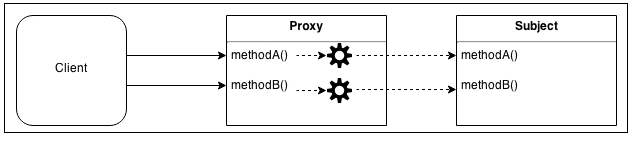
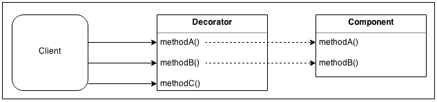

# Design Patterns in Node.js

## Creational Patterns

### Singletons

The singleton patterns `restricts object creation for a class to only one instance`.
Creating singletons in Node.js is pretty straightforward, as require is there to help you.

#### Advantages

 - Reduced memory footprint
 - Single point of access
 - Delayed initialization that prevents instantiation until required

#### Disadvantages

 - Once instantiated, they're hardly ever "reset"
 - Harder to unit test and sometimes introduces hidden dependencies

#### Links:

 - https://addyosmani.com/resources/essentialjsdesignpatterns/book/#singletonpatternjavascript

#### Example (classic):

```js
var Singleton = (function () {
    var instance;
 
    function createInstance() {
        return new Object("I am the instance");;
    }
 
    return {
        getInstance: function () {
            if (!instance) {
                instance = createInstance();
            }
            return instance;
        }
    };
})();

function run() {
    var instance1 = Singleton.getInstance();
    var instance2 = Singleton.getInstance();
 
    console.log("Same instance? " + (instance1 === instance2));  
}
```

#### Example 1:

```js
let count = 0;

module.exports = function() {
   console.log('Count:', ++count);
}; 
```

```js
const counterA = require('./counter');
const counterB = require('./counter');

counterA();
counterB();
counterA();
```

#### Example 2:

```js
class Counter {
    constructor() {
        this._count = 0;
    }
    
    inc() {
        console.log('Count:', ++this._count);
    }
}

module.exports = new Counter();

```

```js
const counterA = require('./counter');
const counterB = require('./counter');

counterA.inc();
counterB.inc();
counterA.inc();
```

## Factory

The factory pattern is a creational pattern that doesn't require us to use a constructor but provides a generic interface for creating objects. 
This pattern can be really useful when the creation process is complex.

### Advantages

 - Makes complex object creation easy through an interface that can bootstrap this process for you
 - Great for generating different objects based on the environment
 - Practical for components that require similar instantiation or methods
 - Great for decoupling components by bootstrapping the instantiation of a different object to carry out work for particular instances

### Disadvantages

 - Unit testing can be difficult as a direct result of the object creation process being hidden by the factory methods

### Links

 - https://addyosmani.com/resources/essentialjsdesignpatterns/book/#factorypatternjavascript
 

### Example (classic):

```js
function MyClass (options) {  
  this.options = options;
}

function create(options) {  
  // modify the options here if you want
  return new MyClass(options);
}

module.exports.create = create; 
```

### Example 1:

```js
function createImage(name) {
  if (name.match(/\.jpeg$/)) {
    return new JpegImage(name);
  } else if (name.match(/\.gif$/)) {
    return new GifImage(name);
  } else if (name.match(/\.png$/)) {
    return new PngImage(name);
  } else {
    throw new Exception('Unsupported format');
  }
}
```

### Example 2:

```js
class Profiler {
    constructor(label) {
        this.label = label;
        this.lastTime = null;
    }

    start() {
        this.lastTime = process.hrtime();
    }

    end() {
        var diff = process.hrtime(this.lastTime);
        var millis = (diff[0] * 1e9 + diff[1]) / 1e6;
        console.log('Timer "%s" took %d ms', this.label, millis);
    }
}

module.exports = function(label) {
    if (process.env.NODE_ENV === 'development') {
        return new Profiler(label);

    } else if (process.env.NODE_ENV === 'production') {
        return {
            start: function() {},
            end: function() {}
        }

    } else {
        throw new Error('Must set NODE_ENV');
    }
};
```

```js
var profiler = require('./profiler');

function getRandomArray(len) {
    var p = profiler('Generating a ' + len + ' items long array');

    p.start();

    var arr = [];
    for(var i = 0; i < len; i++) {
        arr.push(Math.random());
    }

    p.end();
}

getRandomArray(1e6);
console.log('Done');
```


### Prototype

The prototype pattern focuses on creating an object that can be used as a blueprint for other objects through prototypal inheritance. 
This pattern is inherently easy to work with in JavaScript because of the native support for prototypal inheritance in JS which means we don't need to spend time or effort imitating this topology.

#### Advantages

 - New objects created from the "skeleton" of an existing object inherit references to existing functions on the prototype chain, thus boosting performance and keeping memory footprints to a minimum.
 - Great for an application where the focus is on object creation

#### Disadvantages

 - Overkill for a project that uses very few objects and/or does not have an underlying emphasis on the extension of prototype chains

```js 
function BaseAccess() {
    this.url = 'api.abstract.com';
}

BaseAccess.prototype.send = function(message) {
    console.log('Sent message "%s" to server %s', message, this.url);
};


function AmazonAccess() {
    this.url = 'api.aws.com';
}

AmazonAccess.prototype = new BaseAccess();


var amazonAccess = new AmazonAccess();

amazonAccess.send('Hello, AWS!'); // Sent message "Hello, AWS!" to server api.aws.com
```


## Structural Patterns

### Proxy 

A proxy is an object that controls the access to another object called `subject`. 
The proxy and the subject have an identical interface and this allows us to transparently swap one for the other; in fact, the alternative name for this pattern is `surrogate`. 
A proxy intercepts all or some of the operations that are meant to be executed on the subject, augmenting or complementing their behavior. 



**A proxy is useful in several circumstances, for example, consider the following ones:**

 - `Data validation`: The proxy validates the input before forwarding it to the subject
 - `Security`: The proxy verifies that the client is authorized to perform the operation and it passes the request to the subject only if the outcome of the check is positive
 - `Caching`: The proxy keeps an internal cache so that the operations are executed on the subject only if the data is not yet present in the cache
 - `Lazy initialization`: If the creation of the subject is expensive, the proxy can delay it to when it's really necessary
 - `Logging`: The proxy intercepts the method invocations and the relative parameters, recoding them as they happen
 - `Remote objects`: A proxy can take an object that is located remotely, and make it appear local


#### Object composition example

```js
function createProxy(subject) {
  var proto = Object.getPrototypeOf(subject);
   
  function Proxy(subject) {
    this.subject = subject;
  }
  
  Proxy.prototype = Object.create(proto);
  
  // proxied method
  Proxy.prototype.message = function() {
    return this.subject.message() + ' world!';
  }
  
  // delegated method
  Proxy.prototype.terminate = function() {
    return this.subject.terminate.apply(this.subject, arguments);
  }
  
  return new Proxy(subject);
}
```

```js
function createProxy(subject) {
  return {
  
    // proxied method
    message: function() {
      return subject.message() + ' world!';
    },
  
    // delegated method
    terminate: function() {
      return subject.terminate.apply(subject, arguments);
    }
    
  };
}
```

#### Object augmentation (or monkey patching) example

```js
function createProxy(subject) {
  var messageOrig = subject.message;
  
  subject.message = function() {
    return messageOrig.call(this) + ' world!';
  }
  
  return subject;
}
```

#### Example 

```js
'use strict';

module.exports = function(writableOrig) {
    var proto = Object.getPrototypeOf(writableOrig);

    function LoggingWritable(subject) {
        this.writableOrig = subject;
    }

    LoggingWritable.prototype = Object.create(proto);

    LoggingWritable.prototype.write = function(chunk, encoding, callback) {
            if (!callback && typeof encoding === 'function') {
                callback = encoding;
                encoding = undefined;
            }

            console.log('Writing:', chunk);

            return this.writableOrig.write(chunk, encoding, function() {
                console.log('Finished writing:', chunk);
                callback && callback(null);
            });
        };

    LoggingWritable.prototype.on = function() {
        return this.writableOrig.on.apply(this.writableOrig, arguments);
    };

    LoggingWritable.prototype.end = function() {
        return this.writableOrig.end.apply(this.writableOrig, arguments);
    };

    return new LoggingWritable(writableOrig);
};
```

```js
var fs = require('fs');

const proxy = require('./proxy');

var writable = fs.createWriteStream('./test.txt');

var writableProxy = proxy(writable);

writableProxy.write('First chunk');
writableProxy.write('Second chunk');
writable.write('This is not logged');
writableProxy.end();

// Writing: First chunk
// Writing: Second chunk
// Finished writing: First chunk
// Finished writing: Second chunk
```


### Decorator
    
Decorator is a structural pattern that consists of dynamically augmenting the behavior of an existing object. 
It's different from classical inheritance, because the behavior is not added to all the objects of the same class but only to the instances that are explicitly decorated.

Implementation-wise, it is very similar to the Proxy pattern, but instead of enhancing or modifying the behavior of the existing interface of an object, it augments it with new functionalities.



#### Object composition example

```js
function decorate(component) {
  var proto = Object.getPrototypeOf(component);

  function Decorator(component) {
    this.component = component;
  }
  
  Decorator.prototype = Object.create(proto);
  
  //new method
  Decorator.prototype.settings = function() {
    //...
  };
  
  //delegated method
  Decorator.prototype.message = function() {
    this.component.message.apply(this.component, arguments);
  };
  
  return new Decorator(component);
}
```

#### Object augmentation (or monkey patching) example

```js
function decorate(component) {

  //new method
  component.settings = function() {
    //...
  };
  
  return component;
}
```

### Adapter

Convert the interface of a class into another interface clients expect. 
Adapter lets classes work together that couldn't otherwise because of incompatible interfaces. 

The Adapter pattern allows us to access the functionality of an object using a different interface. 
As the name suggests, it adapts an object so that it can be used by components expecting a different interface.


#### Example:

```js
var path = require('path');

module.exports = function createFsAdapter(db) {
    var fs = {};

    fs.readFile = function(filename, options, callback) {
      if(typeof options === 'function') {
        callback = options;
        options = {};
        
      } else if(typeof options === 'string') {
        options = {encoding: options};
      }
      
      db.get(path.resolve(filename), { valueEncoding: options.encoding }, function(err, value) {
          if(err) {
            if(err.type === 'NotFoundError') {       
              err = new Error('ENOENT, open \'' + filename +'\'');
              err.code = 'ENOENT';
              err.errno = 34;
              err.path = filename;
            }
            
            return callback && callback(err);
          }
          
          callback && callback(null, value);
        }
      );
    };
    
    fs.writeFile = function(filename, contents, options, callback) {
      if(typeof options === 'function') {
        callback = options;
        options = {};
      } else if(typeof options === 'string') {
        options = {encoding: options};
      }
      
      db.put(path.resolve(filename), contents, {
        valueEncoding: options.encoding
      }, callback);
    }
    
    return fs;
}    
```

##### Real `fs` module 

```js
var fs = require('fs');

fs.writeFile('file.txt', 'Hello!', function() {
  fs.readFile('file.txt', { encoding: 'utf8' }, function(err, res) {
    console.log(res);
  });
});

//try to read a missing file
fs.readFile('missing.txt', { encoding: 'utf8' }, function(err, res){
  console.log(err);
});

// { [Error: ENOENT, open 'missing.txt'] errno: 34, code: 'ENOENT', path: 'missing.txt' }
// Hello!
```

##### Adapter for LevelDB

```js
var levelup = require('level');
var fsAdapter = require('./fsAdapter');

var db = levelup('./fsDB', { valueEncoding: 'binary' });
var fs = fsAdapter(db);

fs.writeFile('file.txt', 'Hello!', function() {
  fs.readFile('file.txt', { encoding: 'utf8' }, function(err, res) {
    console.log(res);
  });
});

//try to read a missing file
fs.readFile('missing.txt', { encoding: 'utf8' }, function(err, res){
  console.log(err);
});

// { [Error: ENOENT, open 'missing.txt'] errno: 34, code: 'ENOENT', path: 'missing.txt' }
// Hello!

```

## Behavioral Patterns

### Observer

Define a one-to-many dependency between objects so that when one object changes state, all its dependents are notified and updated automatically. 

This pattern implements a single object (the subject) that maintains a reference to a collection of objects (known as "observers") and broadcasts notifications when a change to state occurs. 
When we don't want to observe an object, we simply remove it from the collection of objects being observed. 
The observer pattern is similar to both the pub/sub implementation and the mediator pattern but still different in purpose & theory. 


An object maintains a list of dependents/observers and notifies them automatically on state changes. 
To implement the observer pattern, EventEmitter comes to the rescue.

```js
var util = require('util');  
var EventEmitter = require('events').EventEmitter;

function MyFancyObservable() {  
  EventEmitter.call(this);
}

util.inherits(MyFancyObservable, EventEmitter);

MyFancyObservable.prototype.hello = function (name) {  
  this.emit('hello', name);
};

module.exports = MyFancyObservable;
```

```js
var MyFancyObservable = require('./observer.js');  
var observable = new MyFancyObservable();

observable.on('hello', function (name) {  
  console.log(name);
});

observable.hello('john'); 
```

### Middleware

Middlewares are a powerful yet simple concept: the output of one unit/function is the input for the next.


The technique used to implement middleware is not new; in fact, it can be considered the Node.js incarnation of the Intercepting Filter pattern and the Chain of Responsibility pattern. 
In more generic terms, it also represents a processing pipeline, which reminds us about streams. 
Today, in Node.js, the word middleware is used well beyond the boundaries of the express framework, and indicates a particular pattern whereby a set of processing units, filters, and handlers, under the form of functions are connected to form an asynchronous sequence in order to perform preprocessing and postprocessing of any kind of data. 
The main advantage of this pattern is flexibility; in fact, this pattern allows us to obtain a plugin infrastructure with incredibly little effort, providing an unobtrusive way for extending a system with new filters and handlers.


The essential component of the pattern is the Middleware Manager, which is responsible for organizing and executing the middleware functions. The most important implementation details of the pattern are as follows:

 - New middleware can be registered by invoking the use() function (the name of this function is a common convention in many implementations of this pattern, but we can choose any name). Usually, new middleware can only be appended at the end of the pipeline, but this is not a strict rule.
 - When new data to process is received, the registered middleware is invoked in an asynchronous sequential execution flow. Each unit in the pipeline receives in input the result of the execution of the previous unit.
 - Each middleware can decide to stop further processing of the data by simply not invoking its callback or by passing an error to the callback. An error situation usually triggers the execution of another sequence of middleware that is specifically dedicated to handling errors.

There is no strict rule on how the data is processed and propagated in the pipeline. The strategies include:

 - Augmenting the data with additional properties or functions
 - Replacing the data with the result of some kind of processing
 - Maintaining the immutability of the data and always returning fresh copies as result of the processing

The right approach that we need to take depends on the way the Middleware Manager is implemented and on the type of processing carried out by the middleware itself.

```js
app.use = function(fn){  
  this.middleware.push(fn);
  return this;
};
```

So basically when you add a middleware it just gets pushed into a middleware array. So far so good, but what happens when a request hits the server?

```js
var i = middleware.length;  
while (i--) {  
  next = middleware[i].call(this, next);
}
```

#### Example:

```js
function ZmqMiddlewareManager(socket) {
  this.socket = socket;
  this.inboundMiddleware = [];          
  this.outboundMiddleware = [];
  
  var self = this;
  
  socket.on('message', function(message) {     
    self.executeMiddleware(self.inboundMiddleware, { data: message });
  });
}


ZmqMiddlewareManager.prototype.send = function(data) {
  var self = this;
  var message = {
    data: data
  };
  
  self.executeMiddleware(self.outboundMiddleware, message, function() {
      self.socket.send(message.data);
  });
}


ZmqMiddlewareManager.prototype.use = function(middleware) {
  if(middleware.inbound) {
    this.inboundMiddleware.push(middleware.inbound);
  }
  
  if(middleware.outbound) {
    this.outboundMiddleware.unshift(middleware.outbound);
  }
}


ZmqMiddlewareManager.prototype.executeMiddleware =
  function(middleware, arg, finish) {
    var self = this;
    
    (function iterator(index) {
      if(index === middleware.length) {
        return finish && finish();
      }
      
      middleware[index].call(self, arg, function(err) {
        if(err) {
          console.log('There was an error: ' + err.message);
        }
        
        iterator(++index);
      });
      
    })(0);
  }
}

module.exports = ZmqMiddlewareManager;
```

#### Example of middleware to support JSON messages

```js
module.exports.json = function() {
  return {
    inbound: function(message, next) {
      message.data = JSON.parse(message.data.toString());
      next();
    },
    outbound: function(message, next) {
      message.data = new Buffer(JSON.stringify(message.data));
      next();
    }
  }
}
```

#### Server 

```js
var zmq = require('zmq');
var ZmqMiddlewareManager = require('./zmqMiddlewareManager');
var middleware = require('./middleware');

var reply = zmq.socket('rep');
reply.bind('tcp://127.0.0.1:5000');

var zmqm = new ZmqMiddlewareManager(reply);
zmqm.use(middleware.zlib());
zmqm.use(middleware.json());

zmqm.use({
  inbound: function(message, next) {
    console.log('Received: ', message.data);
    if(message.data.action === 'ping') {
      this.send({action: 'pong', echo: message.data.echo});
    }
    next();
  }
});
```


#### Client 

```js
var zmq = require('zmq');
var ZmqMiddlewareManager = require('./zmqMiddlewareManager');
var middleware = require('./middleware');

var reply = zmq.socket('req');
reply.bind('tcp://127.0.0.1:5000');

var zmqm = new ZmqMiddlewareManager(reply);
zmqm.use(middleware.zlib());
zmqm.use(middleware.json());

zmqm.use({
  inbound: function(message, next) {
    console.log('Echoed back: ', message.data);
    next();
  }
});

setInterval(function() {
  zmqm.send({action: 'ping', echo: Date.now()});
}, 1000);
```