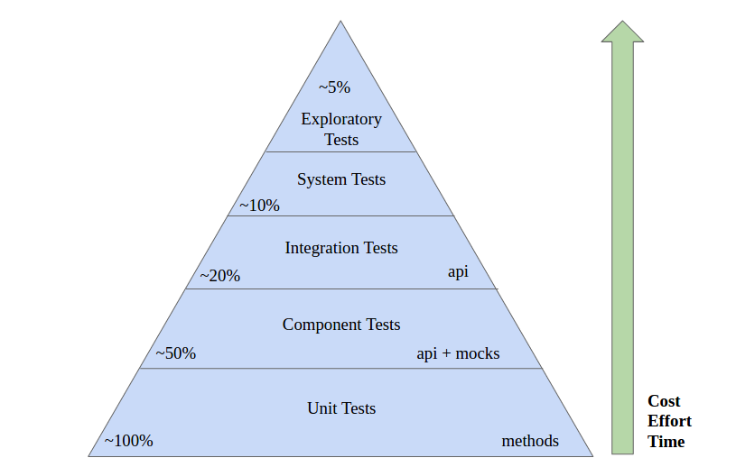
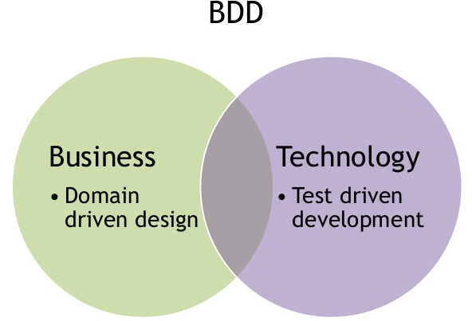
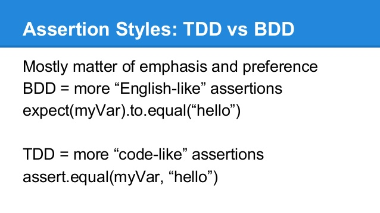
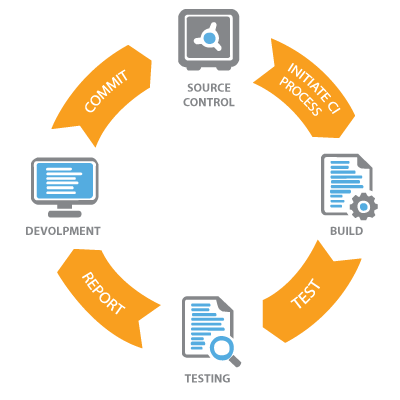

# Testing in Node.js

## How to do your testing most effective and fast?

### Equivalence Classes (Equivalence Partitioning)


Links: 

 - (RU) http://33testers.blogspot.com/2013/07/blog-post_27.html
 - (RU) http://w1zle.blogspot.com/2010/11/boundary-value-testing.html
 - (EN) http://www.ruleworks.co.uk/testguide/BS7925-2-Annex-B2.asp


### Boundary Value Analysis


Links: 

 - (RU) http://33testers.blogspot.com/2013/07/blog-post_27.html
 - (RU) http://w1zle.blogspot.com/2010/11/boundary-value-testing.html
 - (EN) http://www.ruleworks.co.uk/testguide/BS7925-2-Annex-B2.asp


### The test automation pyramid




### Definitions of test levels

#### Unit

 - These tests are written by programmers, for programmers, in the programming language of the system. 
 - The intent of these tests is to specify the system at the lowest level. 
 - Developers write these tests before writing production code as a way to specify what they are about to write. 
 - Unit tests provide as close to 100% coverage as is practical. 


#### Component 

 - Generally they are written against individual components of the system. 
 - The components of the system encapsulate the business rules, so the tests for those components are the acceptance tests for those business rules
 - Any other system components are decoupled from the test using appropriate mocking and test-doubling techniques
 - Component tests cover roughly half the system


#### Integration

 - They do not test business rules. 
 - They test how well the assembly of components communicate with each other
 - They are plumbing tests that make sure that the components are properly connected and can clearly communicate with each other
 - The tests ensure that the architectural structure of the system is sound. 
 - It is at this level that we might see performance and throughput tests.


#### System 

 - These are automated tests that execute against the entire integrated system. 
 - They are the ultimate integration tests. 
 - They do not test business rules directly. Rather, they test that the system has been wired together correctly and its parts interoperate according to plan. 
 - We would expect to see throughput and performance tests in this suite.
 - Their intent is not to ensure correct system behavior, but correct system construction.

#### Exploratory

 - These tests can be not automated
 - The intent of these tests is to explore the system for unexpected behaviors while confirming expected behaviors
 - Process of testing should have specific goal

Links:

 - (RU) Уровни Тестирования Программного Обеспечения http://www.protesting.ru/testing/testlevels.html
 - (EN) Testing Strategies in a Microservice Architecture http://martinfowler.com/articles/microservice-testing/
 - (EN) Book Robert C. Martin - The Clean Coder http://www.amazon.com/Clean-Coder-Conduct-Professional-Programmers/dp/0137081073/ref=sr_1_1?ie=UTF8&qid=1323109523&sr=8-1
 - (RU) Андрей Солнцев - Экономически эффективный процесс тестирования https://www.youtube.com/watch?v=PZq_J1AuSL0
 - (RU) Андрей Солнцев - Пацан накодил — пацан протестил! https://www.youtube.com/watch?v=8u6_hctdhqI


## Approaches

### TDD 


#### The Three Laws of TDD

 - You are not allowed to write any production code until you have first written a failing unit test.
 - You are not allowed to write more of a unit test than is sufficient to fail—and not compiling is failing.
 - You are not allowed to write more production code that is sufficient to pass the currently failing unit test.

Links:

 - (EN) Book Robert C. Martin - The Clean Coder http://www.amazon.com/Clean-Coder-Conduct-Professional-Programmers/dp/0137081073/ref=sr_1_1?ie=UTF8&qid=1323109523&sr=8-1
 - (EN) Test-Driven Development with Node.js http://www.lynda.com/Node-js-tutorials/Test-Driven-Development-Node-js/383527-2.html
 - (EN) Unit Testing and TDD in Node.js https://www.codementor.io/nodejs/tutorial/unit-testing-nodejs-tdd-mocha-sinon


### BDD



#### Specification as a ubiquitous language

Behavior-driven development borrows the concept of the `ubiquitous language` from `domain driven design`. 
A `ubiquitous language` is a (semi-)formal language that is shared by all members of a software development team — both software developers and non-technical personnel.
The language in question is both used and developed by all team members as a common means of discussing the domain of the software in question.
In this way BDD becomes a vehicle for communication between all the different roles in a software project.



Links:

 - (EN) Dan North - Introducing BDD http://dannorth.net/introducing-bdd/
 - (RU) Разработка на основе предметной области (Domain-Driven Design, DDD) https://habrahabr.ru/post/258693/
 - (EN) Eric Evans - Domain-Driven Design: Tackling Complexity in the Heart of Software http://www.amazon.com/Domain-Driven-Design-Tackling-Complexity-Software/dp/0321125215
 
 
### Mocks and Stubs


 - `Stub` have already written with predetermined behavior. 
 - `Mock` is something that as part of your test you have to setup with your expectations.

Links:

 - (EN) Martin Fowler - Mocks Aren't Stubs http://martinfowler.com/articles/mocksArentStubs.html


## Tools and libraries

   - Mocha https://mochajs.org/
   - Should https://shouldjs.github.io/
   - Chai http://chaijs.com/
   - Supertest https://www.npmjs.com/package/supertest
   - Sinon http://sinonjs.org/


## Patterns and best practices in testing

 - (EN) TDD Anti-Patterns http://blog.james-carr.org/2006/11/03/tdd-anti-patterns/
 - (RU) Анти-паттерны TDD https://habrahabr.ru/post/43761/
 - (EN) TDD Patterns and Anti-Patterns http://qabok.com/tdd-patterns-and-anti-patterns/
 
 
## Continuous Integration



`Continuous Integration (CI)` is a development practice that requires developers to integrate code into a shared repository several times a day. 
Each check-in is then verified by an automated build, allowing teams to detect problems early.

### Practices of Continuous Integration

  - Maintain a Single Source Repository.
  - Automate the Build
  - Make Your Build Self-Testing
  - Everyone Commits To the Mainline Every Day
  - Every Commit Should Build the Mainline on an Integration Machine
  - Fix Broken Builds Immediately
  - Keep the Build Fast
  - Test in a Clone of the Production Environment
  - Make it Easy for Anyone to Get the Latest Executable
  - Everyone can see what's happening
  - Automate Deployment

### Tools:

#### Jenkins https://jenkins-ci.org/

Jenkins was created after a falling out between Hudson project contributors and the company that acquired Sun Microsystems. 
It is developed in Java and can be installed using simple java -jar jenkins.war command after downloading the WAR file. 
Jenkins' focus is on two major jobs: building/testing software projects continuously and monitoring externally run jobs.
For the former, Jenkins supports an array of SCM tools—Git, Mercurial, Subversion, Clearcase, and many more. 
Note that almost all the configurations can be done via the web-based GUI.

#### Travis CI https://travis-ci.org/

Travis CI is probably one of the easiest CI servers to get started with. 
Travis CI is open source and obviously free to host on your own server, but it also offers a SaaS version that allows free testing for open source projects. 
Setup is as easy as linking your GitHub account, giving the relevant permissions, and updating the travis.yaml file with your project specific requirements. 
A new Travis CI build is triggered after a file is committed to GitHub.

```yml
language: node_js
node_js:
  - "4.4"
services:
  - mongodb
  - redis-server
env:
  - NODE_ENV=test
```

#### Go https://www.go.cd/

`Go` was created and then open sourced by ThoughtWorks. 
As with other advanced CI servers, `Go` lets you distribute your builds across different systems and monitor them all in one place. 
To use this, you need to install it on your server—there is no SaaS available.

With Go, regularly performed tasks can be added as pipelines. The instances of these activities are called jobs. 
Another interesting addition is the ability to visualize the entire continuous delivery workflow with the value stream map. 
The map helps you track the entire change from commit to deployment.

Links:

 - Martin Fowler - Continuous Integration http://www.martinfowler.com/articles/continuousIntegration.html
 - Comparison of continuous integration software https://en.wikipedia.org/wiki/Comparison_of_continuous_integration_software
 

## Continuous Delivery and Continuous Deployment


Getting software released to users is often a painful, risky, and time-consuming process.

`Continuous Delivery` is a software engineering approach in which teams produce software in short cycles, ensuring that the software can be reliably released at any time.
It aims at building, testing, and releasing software faster and more frequently. 
The approach helps reduce the cost, time, and risk of delivering changes by allowing for more incremental updates to applications in production. 
A straightforward and repeatable deployment process is important for continuous delivery.

`Continuous Deployment` can be thought of as an extension of `Continuous Integration` / `Continuous Delivery`, aiming at minimizing lead time, the time elapsed between development writing one new line of code and this new code being used by live users, in production.

### 8 Principles of Continuous Delivery

  - `The process for releasing/deploying software MUST be repeatable and reliable.` This leads onto the 2nd principle…
  - `Automate everything!` A manual deployment can never be described as repeatable and reliable (not if I’m doing it anyway!). You have to invest seriously in automating all the tasks you do repeatedly, and this tends to lead to reliability.
  - `If somethings difficult or painful, do it more often.` On the surface this sounds silly, but basically what this means is that doing something painful, more often, will lead you to improve it, probably automate it, and this will eventually make it painless and easy. Take for example doing a deployment of a database schema. If this is tricky, you tend to not do it very often, you put it off, maybe you’ll do 1 a month. Really what you should do is improve the process of doing the schema deployments, get good at it, and do it more often, like 1 a day if needed. If you’re doing something every day, you’re going to be a lot better at it than if you only do it once a month.
  - `Keep everything in source control` – this sounds like a bit of a weird one in this day and age, I mean seriously, who doesn’t keep everything in source control? Apparently quite a few people. Who knew?
  - `Done means “released”.` This implies ownership of a project right up until it’s in the hands of the user, and working properly. There’s none of this “I’ve checked in my code so it’s done as far as I’m concerned”. I have been fortunate enough to work with some software teams who eagerly made sure their code changes were working right up to the point when their changes were in production, and then monitored the live system to make sure their changes were successful. On the other hand I’ve worked with teams who though their responsibility ended when they checked their code in to the VCS.
  - `Build quality in!` Take the time to invest in your quality metrics. A project with good, targeted quality metrics (we could be talking about unit test coverage, code styling, rules violations, complexity measurements – or preferably, all of the above) will invariably be better than one without, and easier to maintain in the long run.
  - `Everybody has responsibility for the release process.` A program running on a developers laptop isn’t going to make any money for the company. Similarly, a project with no plan for deployment will never get released, and again make no money. Companies make money by getting their products released to customers, therefore, this process should be in the interest of everybody. Developers should develop projects with a mind for how to deploy them. Project managers should plan projects with attention to deployment. Testers should test for deployment defects with as much care and attention as they do for code defects (and this should be automated and built into the deployment task itself).
  - `Improve continuously.` Don’t sit back and wait for your system to become out of date or impossible to maintain. Continuous improvement means your system will always be evolving and therefore easier to change when needs be.


### 4 Practices of Continuous Delivery

  - `Build binaries only once.` You’d be staggered by the number of times I’ve seen people recompile code between one environment and the next. Binaries should be compiled once and once only. The binary should then be stored someplace which is accessible only to your deployment mechanism, and your deployment mechanism should deploy this same binary to each successive environment…
  - `Use precisely the same mechanism to deploy to every environment.` It sounds obvious, but I’ve genuinely seen cases where deployments to QA were automated, only for the production deployments to be manual. I’ve also seen cases where deployments to QA and production were both automated, but in 2 entirely different languages. This is obviously the work of mad people.
  - `Smoke test your deployment.` Don’t leave it to chance that your deployment was a roaring success, write a smoke test and include that in the deployment process. I also like to include a simple diagnostics test, all it does it check that everything is where it’s meant to be – it compares a file list of what you expect to see in your deployment against what actually ends up on the server. I call it a diagnostics test because it’s a good first port of call when there’s a problem.
  - `If anything fails, stop the line!` Throw it away and start the process again, don’t patch, don’t hack. If a problem arises, no matter where, discard the deployment (i.e. rollback), fix the issue properly, check it in to source control and repeat the deployment process. A lot of people comment that this is impossible, especially if you’ve got a tiny outage window to deploy things to your live system, or if you do your production changes are done in the middle of the night while nobody else is around to fix the issue properly. I would say that these arguments rather miss the point. Firstly, if you have only a tiny outage window, hacking your live system should be the last thing you want to do, because this will invalidate all your other environments unless you similarly hack all of them as well. Secondly, the next time you do a deployment, you may reintroduce the original issue. Thirdly, if you’re doing your deployments in the middle of the night with nobody around to fix issues, then you’re not paying enough attention to the 7th principle of Continuous Delivery – Everybody has responsibility for the release process. Unless you can’t avoid it, I wouldn’t recommend doing releases when there’s the least amount of support available, it simply goes against common sense.


### Links:

  - (EN) Jez Humble, David Farley - Continuous Delivery: Reliable Software Releases through Build, Test, and Deployment Automation https://www.safaribooksonline.com/library/view/continuous-delivery-reliable/9780321670250/
  - (EN) Engineering Practices for Continuous Delivery https://www.safaribooksonline.com/library/view/engineering-practices-for/9781491908181/
  - (EN) DZone's Guide to Continuous Delivery https://dzone.com/guides/continuous-delivery-3
  
